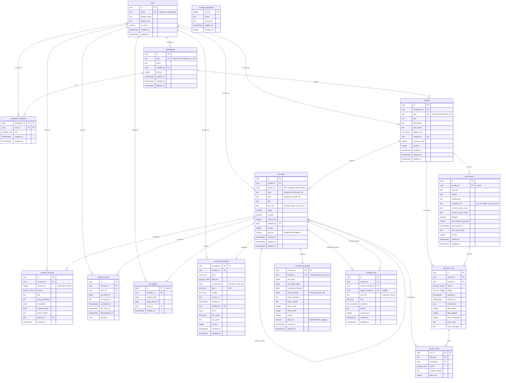

# Database — Engineering Knowledge Workspace

> **Status:** Build contract. This document is the single source of truth for the persistence layer.
> The `## DDL` block below is copied verbatim into `sql/migrations/` (split as described in
> *Migration approach*) and is the only authority on table shape. No implementation subagent may
> create a table, column, index, constraint, enum, or trigger that does not appear here; if a
> module needs one, this document changes first.
>
> **Storage engine:** PostgreSQL 17 — always. There is no second datastore, no cache tier, no
> document store. Yjs binary updates, Lexical block payloads, OKF frontmatter, and the concept
> hierarchy all live in Postgres.

---

## Overview

### Engine and version

| Item | Value | Notes |
|---|---|---|
| Engine | **PostgreSQL 17** | Mandated by the research (Part II §5) and the objectives. Minimum supported server version is `17.0`; the runner asserts `current_setting('server_version_num')::int >= 170000` and fails loudly (`ConfigError('db.unsupportedVersion')`) otherwise. |
| Driver | **`pg` (node-postgres) `^8`** | Parameterised queries only. Constructed *exclusively* in `src/server/orchestrator.ts` per the Architecture "Central Orchestrator" rules. |
| Access interface | **`Db` port** (`src/server/ports.ts`) | Every repository depends on the interface, never on `pg`. This is what makes data-access unit tests hermetic. |
| Encoding / collation | `UTF8`, database collation `en_US.UTF-8`, **`ctype`-independent columns use `COLLATE "C"`** | `slug`, `path`, and `sort_key` are declared `COLLATE "C"` so that ordering and uniqueness are byte-deterministic and immune to ICU/libc collation version drift. This matters: a fractional-index `sort_key` compared under a locale-aware collation can reorder the sidebar after an OS upgrade. |
| Timezone | All timestamps `TIMESTAMPTZ`, server `timezone = 'UTC'` | No naked `TIMESTAMP` columns exist. |

### Extensions

Only three extensions are required, and each is a standard contrib module available in any stock
PostgreSQL 17 installation. `gen_random_uuid()` is **core** in PostgreSQL 13+, so `pgcrypto` is *not*
required for id generation.

| Extension | Required? | Used for |
|---|---|---|
| `pg_trgm` | **Required** | Trigram GIN index on `concepts.title` and `concepts.slug` for the sidebar's fuzzy "jump to concept" filter and for `ILIKE '%…%'` path lookups that full-text search cannot serve (partial words, identifiers, `snake_case` tokens). |
| `btree_gin` | **Required** | Lets a single GIN index combine a scalar (`bundle_id uuid`) with a `tsvector` / `jsonb`. Without it, every bundle-scoped search is a full-index scan plus a filter; with it, `(bundle_id, body_tsv)` is one index and one bitmap. |
| `unaccent` | **Required** | Wired into the `okf_english` text-search configuration so `résumé` and `resume` match. The configuration is created by migration `001`, not assumed to exist. |
| `pg_jsonschema` | **Not used** | The research mentions it as an option. It is **not** a core contrib module, is unavailable on several managed Postgres offerings, and would create a silent environment dependency. JSONB shape is instead enforced by (a) `CHECK` constraints on `jsonb_typeof` and required top-level keys, and (b) `zod` parsing at every read-back and write boundary, per the Architecture "Validation" row. This is a deliberate, documented substitution — not a silent fallback. |

### Connection strategy

A **single `pg.Pool`**, created once by the orchestrator during `start()` and closed in `stop()`.
Nothing else in the codebase constructs a pool or a client.

```ts
// src/server/adapters/pg-db.ts — the ONLY module that imports "pg"
const pool = new Pool({
  connectionString: config.db.url,          // validated by zod at load time
  max: config.db.poolMax,                   // default 10, must be >= 2
  min: 0,
  idleTimeoutMillis: 30_000,
  connectionTimeoutMillis: 5_000,
  application_name: `ekw/${config.env}/${config.instanceId}`,
  ssl: config.db.ssl ? { rejectUnauthorized: true } : false,
});
```

Every checked-out connection is initialised once, on the pool's `connect` event:

| Session setting | Value | Why |
|---|---|---|
| `statement_timeout` | `10000` (10 s) | A runaway recursive CTE over a malformed hierarchy must not pin a connection. |
| `idle_in_transaction_session_timeout` | `15000` | A dropped websocket mid-transaction must not hold row locks on `concept_documents`. |
| `lock_timeout` | `3000` | Tree moves take advisory locks; a contended move fails fast and is retried by the caller rather than queueing. |
| `search_path` | `public` | Explicit; never inherited from the role. |
| `default_transaction_isolation` | `read committed` | The default. `repeatable read` is requested explicitly, per transaction, only by the Git-sync export snapshot. |

**The `Db` port.** All repositories receive this and nothing else:

```ts
// src/server/ports.ts
export type Isolation = "read committed" | "repeatable read" | "serializable";

export interface Db {
  /** Parameterised query. `sql` must contain only $1..$n placeholders; string
   *  interpolation of values is a review-blocking defect. */
  query<TRow>(sql: string, params?: readonly unknown[]): Promise<{ rows: TRow[]; rowCount: number }>;

  /** Runs `fn` inside a transaction on a single pinned connection. Commits on
   *  resolve, rolls back on reject, always releases. Nested calls reuse the
   *  same connection and open a SAVEPOINT. */
  withTransaction<T>(
    fn: (tx: Db) => Promise<T>,
    opts?: { isolation?: Isolation; readOnly?: boolean },
  ): Promise<T>;
}
```

Two concurrency primitives are used and no others:

1. **Optimistic concurrency** — every mutable aggregate row (`bundles`, `concepts`,
   `concept_frontmatter`, `concept_documents`) carries `version integer NOT NULL DEFAULT 1`.
   Updates are `… SET version = version + 1 WHERE id = $1 AND version = $2`; a zero `rowCount`
   raises `ConflictError('concept.staleVersion')`, which the GraphQL layer maps to an extension
   Relay can use to roll back its optimistic update.
2. **Transaction-scoped advisory locks** for hierarchy mutation, keyed on the bundle:
   `SELECT pg_advisory_xact_lock(hashtextextended($1::text, 0))`. Sibling `sort_key` allocation and
   `path` rewrites are only correct if serialised per bundle; taking a row lock on a moving subtree
   is not sufficient because the *destination* siblings must also be stable.

### Migration approach

Plain, numbered, forward-only SQL files plus a ~120-line runner — no framework.

```
sql/
  migrations/
    001_extensions_enums_functions.sql
    002_identity_and_workspaces.sql
    003_bundles_and_concepts.sql
    004_concept_documents_and_crdt.sql
    005_frontmatter_links_revisions.sql
    006_search_indexes.sql
    007_collaboration_and_git_sync.sql
  seed/
    001_dev_seed.sql
```

Rules the runner (`src/server/migrate.ts`) enforces:

- Bookkeeping lives in `schema_migrations` (defined in the DDL below). It records `version`,
  `name`, `checksum` (SHA-256 of the file bytes), `applied_at`, and `duration_ms`.
- Before doing anything it takes `pg_advisory_lock(4479823001)` so two app instances starting
  simultaneously cannot both migrate.
- Each file runs inside **one transaction**. Postgres has transactional DDL; a half-applied
  migration is not a state this system can reach.
- If a file's checksum differs from the recorded one, the runner throws
  `MigrationError('migration.checksumMismatch')` and refuses to start. Editing an applied
  migration is not permitted; write `00N+1`.
- Files are applied in strict numeric order; a gap throws `MigrationError('migration.gap')`.
- `start()` runs a **check**, not an apply, unless `config.db.autoMigrate` is true (dev only).
  In production, a pending migration is a startup failure with the list of pending versions —
  never a silent auto-apply.
- Down-migrations do not exist. Reversal is a new forward migration.

Every `CREATE` statement in the DDL below is written idempotently (`IF NOT EXISTS`, or guarded by a
`DO $$ … $$` block for enum types, which do not support `IF NOT EXISTS` on `CREATE TYPE`), so a
re-run against a partially-migrated database is safe.

---

## Data Models

Fifteen tables plus the migration ledger. Grouped by module ownership (per the Architecture module
map): identity, bundles/concepts (BundleModule, ConceptModule, HierarchyModule), documents
(DocumentModule), frontmatter (FrontmatterModule), links + revisions, search (SearchModule — read
paths only; it owns no tables of its own by design, see the note below), collaboration
(CollabModule), and Git sync (GitSyncModule).

> **Why `SearchModule` owns no table.** A separate materialised search table would require a
> synchronisation path between it and `concept_documents`, and every such path is a source of silent
> staleness. Instead the search columns (`title_tsv`, `body_tsv`, `content_blocks`) are `GENERATED
> ALWAYS AS … STORED` on the rows they describe, so they cannot drift by construction, and
> `SearchModule` is a pure read-side consumer.

### Conventions applied to every table

| Convention | Rule |
|---|---|
| Primary key | `uuid` named `id`, `DEFAULT gen_random_uuid()`, except join tables (composite PK) and append-only logs (`bigint … GENERATED ALWAYS AS IDENTITY`). |
| Global IDs | Relay global IDs (`base64("Concept:<uuid>")`) are **computed in `src/core/global-id.ts`**, never stored. The database never sees a base64 id. |
| Timestamps | `created_at TIMESTAMPTZ NOT NULL DEFAULT now()`; `updated_at TIMESTAMPTZ NOT NULL DEFAULT now()` maintained by the `set_updated_at()` trigger — never by application code. |
| Soft delete | `deleted_at TIMESTAMPTZ` on user-visible aggregates (`workspaces`, `bundles`, `concepts`). All read paths filter `deleted_at IS NULL`; uniqueness indexes are partial on the same predicate so a slug is reusable after trashing. |
| Optimistic concurrency | `version integer NOT NULL DEFAULT 1` on mutable aggregates. |
| Text domains | `slug`, `path`, `sort_key` are `text COLLATE "C"` with `CHECK` regexes. |
| Deletes | `ON DELETE CASCADE` downward through ownership (workspace → bundle → concept → document/frontmatter/links/revisions). `ON DELETE RESTRICT` for `created_by`/`author_id` references to `users`, so audit trails cannot be silently erased. |

---

### `schema_migrations` — migration ledger

**Purpose:** records which migration files have been applied, with a content checksum so an edited
migration is detected rather than silently diverging.

| Column | Type | Constraints / Default | Purpose |
|---|---|---|---|
| `version` | `integer` | **PK** | Numeric prefix of the file (`001` → `1`). |
| `name` | `text` | `NOT NULL` | File name without the numeric prefix. |
| `checksum` | `text` | `NOT NULL`, `CHECK (checksum ~ '^[0-9a-f]{64}$')` | SHA-256 of the file bytes, lowercase hex. |
| `applied_at` | `timestamptz` | `NOT NULL DEFAULT now()` | When it ran. |
| `duration_ms` | `integer` | `NOT NULL`, `CHECK (duration_ms >= 0)` | Observability; surfaced by `migrate --status`. |

**Indexes:** PK only.

---

### `users` — actors

**Purpose:** the identity a mutation, revision, collaboration session, or Git commit is attributed
to. Authentication itself is out of scope for the persistence layer; this table stores the
attributable identity, never a credential.

| Column | Type | Constraints / Default | Purpose |
|---|---|---|---|
| `id` | `uuid` | **PK**, `DEFAULT gen_random_uuid()` | |
| `email` | `text` | `NOT NULL`, `CHECK (email ~ '^[^@[:space:]]+@[^@[:space:]]+\.[^@[:space:]]+$')` | Login identity. Uniqueness is case-insensitive via a functional index, not a `citext` extension. |
| `display_name` | `text` | `NOT NULL`, `CHECK (length(btrim(display_name)) BETWEEN 1 AND 200)` | Rendered in presence avatars and Git commit trailers. |
| `avatar_color` | `text` | `NOT NULL DEFAULT '#6b7280'`, `CHECK (avatar_color ~ '^#[0-9a-f]{6}$')` | Deterministic presence colour, also handed to Yjs awareness. |
| `is_active` | `boolean` | `NOT NULL DEFAULT true` | Deactivated users keep their revisions but cannot open sessions. |
| `created_at` / `updated_at` | `timestamptz` | `NOT NULL DEFAULT now()` | |

**Indexes**

| Name | Definition | Serves |
|---|---|---|
| `users_pkey` | `PRIMARY KEY (id)` | Node interface resolution. |
| `users_email_lower_key` | `UNIQUE (lower(email))` | Case-insensitive uniqueness and login lookup. |

**No credential columns exist.** Password hashes, OAuth tokens, and Git credentials are never stored
in this database — see `git_remotes.credential_ref`.

---

### `workspaces` — top-level tenant container

| Column | Type | Constraints / Default | Purpose |
|---|---|---|---|
| `id` | `uuid` | **PK**, `DEFAULT gen_random_uuid()` | |
| `slug` | `text COLLATE "C"` | `NOT NULL`, `CHECK (slug ~ '^[a-z0-9]+(-[a-z0-9]+)*$')`, `length ≤ 64` | URL segment: `/w/:slug`. |
| `name` | `text` | `NOT NULL`, `CHECK (length(btrim(name)) BETWEEN 1 AND 200)` | Display name in the app frame. |
| `created_by` | `uuid` | `NOT NULL REFERENCES users(id) ON DELETE RESTRICT` | |
| `version` | `integer` | `NOT NULL DEFAULT 1` | Optimistic concurrency. |
| `created_at` / `updated_at` | `timestamptz` | `NOT NULL DEFAULT now()` | |
| `deleted_at` | `timestamptz` | nullable | Soft delete. |

**Indexes**

| Name | Definition | Serves |
|---|---|---|
| `workspaces_pkey` | `PRIMARY KEY (id)` | |
| `workspaces_slug_live_key` | `UNIQUE (slug) WHERE deleted_at IS NULL` | Slug reuse after trashing. |

---

### `workspace_members` — membership and role

| Column | Type | Constraints / Default | Purpose |
|---|---|---|---|
| `workspace_id` | `uuid` | **PK part 1**, `REFERENCES workspaces(id) ON DELETE CASCADE` | |
| `user_id` | `uuid` | **PK part 2**, `REFERENCES users(id) ON DELETE CASCADE` | |
| `role` | `member_role` | `NOT NULL DEFAULT 'viewer'` | `owner` \| `admin` \| `editor` \| `viewer`. Authorisation predicates live in the module layer; the DB stores the fact. |
| `created_at` / `updated_at` | `timestamptz` | `NOT NULL DEFAULT now()` | |

**Indexes**

| Name | Definition | Serves |
|---|---|---|
| `workspace_members_pkey` | `PRIMARY KEY (workspace_id, user_id)` | Authorisation check on every request. |
| `workspace_members_user_idx` | `(user_id, workspace_id)` | "My workspaces" sidebar. |
| `workspace_members_one_owner_idx` | `UNIQUE (workspace_id) WHERE role = 'owner'` | A workspace has exactly one owner; demoting requires promoting first. |

---

### `bundles` — OKF Knowledge Bundle

**Purpose:** a self-contained collection of Concepts, and the unit of Git synchronisation. One
bundle maps to one directory tree in one repository.

| Column | Type | Constraints / Default | Purpose |
|---|---|---|---|
| `id` | `uuid` | **PK**, `DEFAULT gen_random_uuid()` | |
| `workspace_id` | `uuid` | `NOT NULL REFERENCES workspaces(id) ON DELETE CASCADE` | Owner. |
| `slug` | `text COLLATE "C"` | `NOT NULL`, slug regex, `length ≤ 96` | URL segment and default Git subdirectory name. |
| `title` | `text` | `NOT NULL`, `1 ≤ length(btrim) ≤ 300` | |
| `description` | `text` | `NOT NULL DEFAULT ''` | Rendered in the bundle header; exported to the bundle root `index.md` frontmatter. |
| `okf_version` | `text` | `NOT NULL DEFAULT '1.0'`, `CHECK (okf_version ~ '^[0-9]+\.[0-9]+$')` | OKF spec version this bundle is written against; emitted into exported frontmatter. |
| `default_trust` | `trust_level` | `NOT NULL DEFAULT 'unverified'` | Trust assigned to newly created Concepts in this bundle. |
| `created_by` | `uuid` | `NOT NULL REFERENCES users(id) ON DELETE RESTRICT` | |
| `concept_count` | `integer` | `NOT NULL DEFAULT 0`, `CHECK (concept_count >= 0)` | Denormalised live-concept count, maintained by the `bundles_concept_count` trigger. Avoids a `COUNT(*)` per bundle card on the workspace index. |
| `version` | `integer` | `NOT NULL DEFAULT 1` | |
| `created_at` / `updated_at` | `timestamptz` | `NOT NULL DEFAULT now()` | |
| `deleted_at` | `timestamptz` | nullable | |

**Indexes**

| Name | Definition | Serves |
|---|---|---|
| `bundles_pkey` | `PRIMARY KEY (id)` | |
| `bundles_workspace_slug_live_key` | `UNIQUE (workspace_id, slug) WHERE deleted_at IS NULL` | Route resolution `/w/:ws/b/:bundle`. |
| `bundles_workspace_list_idx` | `(workspace_id, title COLLATE "C", id) WHERE deleted_at IS NULL` | Bundle Connection, keyset-paginated by title. |

---

### `concepts` — OKF Concept (one Markdown document)

**Purpose:** the hierarchical node. Holds only the *stable relational* facts — identity, position in
the tree, title, path. The fluid payload (blocks, CRDT, Markdown body) lives in `concept_documents`;
the YAML metadata lives in `concept_frontmatter`. This is the hybrid split the research prescribes.

| Column | Type | Constraints / Default | Purpose |
|---|---|---|---|
| `id` | `uuid` | **PK**, `DEFAULT gen_random_uuid()` | |
| `bundle_id` | `uuid` | `NOT NULL REFERENCES bundles(id) ON DELETE CASCADE` | Owning bundle. Also part of `UNIQUE (id, bundle_id)` so children and documents can carry a composite FK. |
| `parent_id` | `uuid` | nullable; composite FK `(parent_id, bundle_id) → concepts(id, bundle_id) ON DELETE CASCADE`; `CHECK (parent_id IS DISTINCT FROM id)` | Hierarchy. `NULL` = bundle root level. The composite FK makes it **structurally impossible** for a child to live in a different bundle than its parent — no trigger needed for that invariant. |
| `slug` | `text COLLATE "C"` | `NOT NULL`, `CHECK (slug ~ '^[a-z0-9]+(-[a-z0-9]+)*$')`, `length ≤ 96` | Filename stem in the exported OKF tree. |
| `path` | `text COLLATE "C"` | `NOT NULL`, `CHECK (path ~ '^[a-z0-9]+(-[a-z0-9]+)*(/[a-z0-9]+(-[a-z0-9]+)*)*$')`, `length ≤ 1024` | Denormalised `/`-joined slug chain from the bundle root, **excluding** the file extension. Maintained transactionally by `HierarchyModule` under the bundle advisory lock; verified by the `hierarchy_path_integrity` check query (see Query Patterns §11). It exists because Git export and relative-link resolution both need the full path for thousands of rows at once, and a recursive CTE per row is not acceptable there. |
| `title` | `text` | `NOT NULL`, `CHECK (length(btrim(title)) BETWEEN 1 AND 300)` | Human title; becomes the exported `title:` frontmatter key and the `# ` H1. |
| `sort_key` | `text COLLATE "C"` | `NOT NULL`, `CHECK (sort_key ~ '^[0-9A-Za-z]{1,64}$')` | **Fractional index** over the base-62 alphabet. Reordering a sibling writes exactly one row (a midpoint string) instead of renumbering the whole sibling set — which matters because sidebar drags are frequent and each renumber would invalidate every open Relay cursor. `COLLATE "C"` is mandatory here: the midpoint algorithm is defined on byte order. |
| `depth` | `smallint` | `NOT NULL DEFAULT 0`, `CHECK (depth BETWEEN 0 AND 64)` | Cached nesting level. Bounds recursion and lets the sidebar indent without walking ancestors. |
| `is_index` | `boolean` | `NOT NULL DEFAULT false` | Author override forcing export to `index.md`. The effective rule is `is_index OR has_children` (see Query Patterns §5) — OKF progressive disclosure. |
| `child_count` | `integer` | `NOT NULL DEFAULT 0`, `CHECK (child_count >= 0)` | Live-child count, maintained by the `concepts_child_count` trigger. The sidebar needs "is this expandable?" for every visible row; a correlated `EXISTS` per row is the single most common N+1 in a tree UI. |
| `created_by` | `uuid` | `NOT NULL REFERENCES users(id) ON DELETE RESTRICT` | |
| `version` | `integer` | `NOT NULL DEFAULT 1` | Optimistic concurrency for rename/move/trash. |
| `created_at` / `updated_at` | `timestamptz` | `NOT NULL DEFAULT now()` | |
| `deleted_at` | `timestamptz` | nullable | Trash. Trashing a parent trashes the subtree (application-level, in one transaction under the advisory lock). |
| `title_tsv` | `tsvector` | `GENERATED ALWAYS AS (setweight(to_tsvector('okf_english', coalesce(title,'')), 'A')) STORED` | Weight-A half of the ranked search vector. Generated, so it can never be stale. |

**Indexes**

| Name | Definition | Serves |
|---|---|---|
| `concepts_pkey` | `PRIMARY KEY (id)` | Node interface, dataloader batch by id. |
| `concepts_id_bundle_key` | `UNIQUE (id, bundle_id)` | Target of the composite FKs from `concepts.parent_id` and `concept_documents`. |
| `concepts_sibling_slug_live_key` | `UNIQUE (bundle_id, COALESCE(parent_id, '00000000-0000-0000-0000-000000000000'::uuid), slug) WHERE deleted_at IS NULL` | Two live siblings cannot share a filename. `COALESCE` is immutable, so it is index-legal; without it, `NULL` parents would compare unequal and root-level slugs would not be unique. |
| `concepts_bundle_path_live_key` | `UNIQUE (bundle_id, path) WHERE deleted_at IS NULL` | Guarantees the exported OKF tree has no colliding file paths, and makes relative-link resolution a single index lookup. |
| `concepts_children_idx` | `(bundle_id, parent_id, sort_key, id) WHERE deleted_at IS NULL` | **The sidebar index.** Serves the children Connection with keyset pagination in index order, `parent_id IS NULL` included. |
| `concepts_bundle_updated_idx` | `(bundle_id, updated_at DESC, id) WHERE deleted_at IS NULL` | "Recently edited" panel; Git-sync incremental export by watermark. |
| `concepts_title_trgm_idx` | `GIN (title gin_trgm_ops)` | Sidebar quick-filter (substring / fuzzy), which full-text cannot serve. |
| `concepts_title_tsv_idx` | `GIN (bundle_id, title_tsv)` (`btree_gin`) | Bundle-scoped title search leg of the ranked query. |
| `concepts_trash_idx` | `(bundle_id, deleted_at DESC) WHERE deleted_at IS NOT NULL` | Trash view and the purge job. |

**Triggers:** `set_updated_at`, `concepts_no_cycle` (constraint trigger, see DDL), `concepts_child_count`, `bundles_concept_count`.

---

### `concept_documents` — CRDT state and block payload (1:1 with `concepts`)

**Purpose:** the fluid half of the hybrid schema. One row per concept, holding the merged Yjs
document, the serialized Lexical `EditorState`, and the Markdown projection used for Git export and
full-text search.

It is a separate table from `concepts` for three concrete reasons: the sidebar query (by far the
hottest read) would otherwise drag multi-hundred-kilobyte `bytea` and `jsonb` columns through the
buffer cache; TOAST churn on every keystroke-batch would bloat the row that the hierarchy indexes
point at; and the DocumentModule/ConceptModule boundary in the Architecture is a table boundary here
too.

| Column | Type | Constraints / Default | Purpose |
|---|---|---|---|
| `concept_id` | `uuid` | **PK**, `REFERENCES concepts(id) ON DELETE CASCADE` | 1:1. |
| `bundle_id` | `uuid` | `NOT NULL`; composite FK `(concept_id, bundle_id) → concepts(id, bundle_id) ON DELETE CASCADE` | Denormalised **only** so that search and export indexes can be bundle-scoped without a join. The composite FK makes the denormalisation impossible to corrupt. |
| `crdt_state` | `bytea` | `NOT NULL DEFAULT '\x'::bytea`, `CHECK (octet_length(crdt_state) <= 33554432)` | `Y.encodeStateAsUpdate(doc)` — the merged Yjs document. 32 MiB ceiling; exceeding it raises `PayloadTooLargeError('document.crdtTooLarge')` rather than silently TOASTing a pathological document. |
| `crdt_state_vector` | `bytea` | `NOT NULL DEFAULT '\x'::bytea`, `CHECK (octet_length(crdt_state_vector) <= 65536)` | `Y.encodeStateVector(doc)`. Lets a reconnecting client be sent a diff without the server decoding the full document. |
| `compacted_through` | `bigint` | `NOT NULL DEFAULT 0`, `CHECK (compacted_through >= 0)` | High-water mark: every `yjs_updates.id ≤ this` is already folded into `crdt_state`. The compaction job deletes below it. |
| `content_blocks` | `jsonb` | `NOT NULL DEFAULT '{"root":{"type":"root","children":[]}}'::jsonb`, `CHECK (jsonb_typeof(content_blocks) = 'object' AND content_blocks ? 'root')` | Serialized Lexical `EditorState` — the block tree. This is the column the research's GIN `jsonb_path_ops` containment index targets. |
| `body_markdown` | `text` | `NOT NULL DEFAULT ''` | Strict Markdown produced by `@lexical/markdown`'s `$convertToMarkdownString`. Written in the same transaction as `content_blocks`, so the Git worker never re-runs the editor to export. |
| `body_sha256` | `text` | `NOT NULL DEFAULT repeat('0',64)`, `CHECK (body_sha256 ~ '^[0-9a-f]{64}$')` | Digest of `body_markdown`. Lets the Git worker skip unchanged files without reading the text, and lets `git_sync_files` record a verifiable content identity. |
| `block_count` | `integer` | `NOT NULL DEFAULT 0`, `CHECK (block_count >= 0)` | Top-level block count; drives the "empty document" UI state without parsing JSONB. |
| `word_count` | `integer` | `NOT NULL DEFAULT 0`, `CHECK (word_count >= 0)` | Displayed in the document header. |
| `version` | `integer` | `NOT NULL DEFAULT 1` | Optimistic concurrency for non-CRDT writes (e.g. a Markdown import that replaces the body). |
| `created_at` / `updated_at` | `timestamptz` | `NOT NULL DEFAULT now()` | |
| `body_tsv` | `tsvector` | `GENERATED ALWAYS AS (setweight(to_tsvector('okf_english', coalesce(body_markdown,'')), 'B')) STORED` | Weight-B half of the ranked vector. `to_tsvector(regconfig, text)` is `IMMUTABLE`, which is what makes a stored generated column legal — the two-argument form is only `STABLE` and would be rejected. |

**Indexes**

| Name | Definition | Serves |
|---|---|---|
| `concept_documents_pkey` | `PRIMARY KEY (concept_id)` | Editor load. |
| `concept_documents_blocks_gin` | `GIN (content_blocks jsonb_path_ops)` | **The containment index the research mandates.** `jsonb_path_ops` indexes only paths-to-leaves, producing an index roughly half the size of `jsonb_ops` and dramatically faster for `@>`. Trade-off, stated explicitly: it supports **only** `@>`, not `?` / `?|` / `?&`. Every key-existence predicate in this codebase is therefore written as a containment predicate. |
| `concept_documents_body_tsv_gin` | `GIN (bundle_id, body_tsv)` (`btree_gin`) | Bundle-scoped full-text body search. |
| `concept_documents_bundle_idx` | `(bundle_id, updated_at DESC)` | Git-sync incremental export scan. |
| `concept_documents_dirty_idx` | `(bundle_id) WHERE compacted_through < 9223372036854775807` — see note | Not used; compaction selects via `yjs_updates` instead. *(No such index is created; listed here only to record that the rejected alternative was considered.)* |

**Storage tuning:** `ALTER TABLE concept_documents ALTER COLUMN crdt_state SET STORAGE EXTERNAL` —
Yjs updates are already binary-compressed, so PGLZ compression costs CPU on every read and write for
no size win. `content_blocks` and `body_markdown` keep the default `EXTENDED`.

---

### `yjs_updates` — append-only CRDT update log

**Purpose:** durability between compactions. The collaboration server appends each binary update as
it arrives; a reconnecting client is caught up from `crdt_state` plus the tail of this table.

| Column | Type | Constraints / Default | Purpose |
|---|---|---|---|
| `id` | `bigint` | **PK**, `GENERATED ALWAYS AS IDENTITY` | Monotonic append order. CRDT updates are commutative, so out-of-commit-order identity assignment under concurrency is harmless — replay order does not affect the merged result. This is why a per-concept sequence (which would need a lock) is deliberately not used. |
| `concept_id` | `uuid` | `NOT NULL REFERENCES concepts(id) ON DELETE CASCADE` | |
| `update_bytes` | `bytea` | `NOT NULL`, `CHECK (octet_length(update_bytes) BETWEEN 1 AND 4194304)` | One `Y.applyUpdate` payload. Empty updates are rejected at the boundary. |
| `origin_client_id` | `bigint` | `NOT NULL`, `CHECK (origin_client_id >= 0)` | Yjs `doc.clientID` of the author. Used to suppress echo and to attribute a change. |
| `actor_id` | `uuid` | nullable `REFERENCES users(id) ON DELETE SET NULL` | Attribution when the socket was authenticated; `NULL` for anonymous read-write links. |
| `created_at` | `timestamptz` | `NOT NULL DEFAULT now()` | Retention cutoff. |

**Indexes**

| Name | Definition | Serves |
|---|---|---|
| `yjs_updates_pkey` | `PRIMARY KEY (id)` | |
| `yjs_updates_concept_idx` | `(concept_id, id)` | "Give me everything after watermark X for this document" — the reconnect path and the compaction read. |

**Retention:** rows with `id <= concept_documents.compacted_through` are deleted by the compaction
transaction. There is no other retention policy; the table's steady-state size is bounded by the
compaction interval, not by time.

---

### `concept_frontmatter` — OKF YAML frontmatter (1:1 with `concepts`)

**Purpose:** the structured metadata panel. Typed columns for the fields OKF defines and the app
queries; a lossless escape hatch for everything else.

| Column | Type | Constraints / Default | Purpose |
|---|---|---|---|
| `concept_id` | `uuid` | **PK**, `REFERENCES concepts(id) ON DELETE CASCADE` | |
| `bundle_id` | `uuid` | `NOT NULL`; composite FK to `concepts(id, bundle_id) ON DELETE CASCADE` | Bundle-scoped filtering without a join. |
| `trust` | `trust_level` | `NOT NULL DEFAULT 'unverified'` | `unverified` \| `machine_confirmed` \| `human_reviewed`. A native enum, not free text: an unknown trust value must be a write-time error, not a rendering surprise. |
| `lifecycle` | `lifecycle_state` | `NOT NULL DEFAULT 'draft'` | `draft` \| `review` \| `published` \| `deprecated` \| `archived`. |
| `provenance` | `jsonb` | `NOT NULL DEFAULT '{}'::jsonb`, `CHECK (jsonb_typeof(provenance) = 'object')` | OKF provenance object: `{source, generator, generated_at, model, commit, …}`. Shape validated by zod on read and write. |
| `tags` | `text[]` | `NOT NULL DEFAULT '{}'::text[]`, `CHECK (array_position(tags, NULL) IS NULL AND cardinality(tags) <= 64)` | Faceted filtering. The `array_position … IS NULL` check is the idiomatic way to forbid NULL elements. |
| `owners` | `text[]` | `NOT NULL DEFAULT '{}'::text[]`, same element checks, `cardinality ≤ 32` | OKF ownership; free-form handles/emails, not FKs, because owners may be teams or external. |
| `source_uri` | `text` | nullable, `CHECK (source_uri IS NULL OR length(source_uri) <= 2048)` | Canonical upstream location. |
| `verified_at` | `timestamptz` | nullable | |
| `verified_by` | `uuid` | nullable `REFERENCES users(id) ON DELETE SET NULL` | |
| `extra` | `jsonb` | `NOT NULL DEFAULT '{}'::jsonb`, `CHECK (jsonb_typeof(extra) = 'object')` | Every frontmatter key the app does not model. Preserving these is what makes the workspace safe to point at somebody else's OKF bundle. |
| `key_order` | `text[]` | `NOT NULL DEFAULT '{}'::text[]` | Original top-level key order from the parsed YAML, so a round-trip through the app produces a minimal Git diff instead of reordering every file. |
| `raw_yaml` | `text` | `NOT NULL DEFAULT ''`, `CHECK (length(raw_yaml) <= 262144)` | The exact frontmatter block as last imported. Used to detect whether the app's re-serialization is lossy and to fall back to byte-identical output when nothing structural changed. |
| `version` | `integer` | `NOT NULL DEFAULT 1` | |
| `created_at` / `updated_at` | `timestamptz` | `NOT NULL DEFAULT now()` | |

**Constraint:** `CHECK ((trust = 'human_reviewed') = (verified_at IS NOT NULL))` — a human-reviewed
concept must record when, and a non-reviewed one must not claim a review timestamp. This is exactly
the sort of invariant that rots if left to the application.

**Indexes**

| Name | Definition | Serves |
|---|---|---|
| `concept_frontmatter_pkey` | `PRIMARY KEY (concept_id)` | |
| `concept_frontmatter_trust_idx` | `(bundle_id, trust, concept_id)` | "Show me everything still `unverified`" — the primary review queue. |
| `concept_frontmatter_lifecycle_idx` | `(bundle_id, lifecycle, concept_id)` | Lifecycle facet. |
| `concept_frontmatter_tags_gin` | `GIN (tags)` | `tags && ARRAY[...]` overlap filtering. |
| `concept_frontmatter_provenance_gin` | `GIN (provenance jsonb_path_ops)` | Containment queries such as "everything generated by model X". |

---

### `concept_links` — resolved cross-links between concepts

**Purpose:** OKF cross-linking. Extracted from `content_blocks` on every save, so backlinks and
broken-link detection are index lookups rather than a corpus scan.

| Column | Type | Constraints / Default | Purpose |
|---|---|---|---|
| `id` | `uuid` | **PK**, `DEFAULT gen_random_uuid()` | |
| `bundle_id` | `uuid` | `NOT NULL`; composite FK with `source_concept_id` | Scope. |
| `source_concept_id` | `uuid` | `NOT NULL`, part of composite FK to `concepts(id, bundle_id) ON DELETE CASCADE` | The document containing the link. |
| `target_concept_id` | `uuid` | nullable `REFERENCES concepts(id) ON DELETE SET NULL` | Resolved target. `NULL` when unresolved or external. Set to `NULL` (not cascade-deleted) when the target is hard-deleted, so the link becomes visibly broken rather than vanishing. |
| `raw_href` | `text` | `NOT NULL`, `CHECK (length(raw_href) BETWEEN 1 AND 2048)` | Exactly as authored: `./sibling.md`, `/bundle/a/b.md`, `https://…`, `#anchor`. |
| `kind` | `link_kind` | `NOT NULL` | `absolute` \| `relative` \| `external` \| `anchor`. |
| `resolution` | `link_resolution` | `NOT NULL DEFAULT 'unresolved'` | `resolved` \| `unresolved` \| `external`. |
| `anchor` | `text` | nullable, `length ≤ 256` | Fragment after `#`. |
| `occurrences` | `integer` | `NOT NULL DEFAULT 1`, `CHECK (occurrences >= 1)` | Same href repeated in one document collapses to one row with a count. |
| `created_at` / `updated_at` | `timestamptz` | `NOT NULL DEFAULT now()` | |

**Constraint:** `CHECK ((resolution = 'resolved') = (target_concept_id IS NOT NULL))`.

**Indexes**

| Name | Definition | Serves |
|---|---|---|
| `concept_links_pkey` | `PRIMARY KEY (id)` | |
| `concept_links_source_href_key` | `UNIQUE (source_concept_id, raw_href)` | Idempotent re-extraction: link rewriting is an upsert, not a delete-and-reinsert. |
| `concept_links_backlinks_idx` | `(target_concept_id, source_concept_id) WHERE target_concept_id IS NOT NULL` | The backlinks panel. |
| `concept_links_broken_idx` | `(bundle_id, source_concept_id) WHERE resolution = 'unresolved'` | Broken-link report for the bundle. |

---

### `concept_revisions` — immutable snapshot history

**Purpose:** point-in-time snapshots taken on Git export, on Markdown import, and on explicit user
checkpoints. Not a per-keystroke log — that is what `yjs_updates` is.

| Column | Type | Constraints / Default | Purpose |
|---|---|---|---|
| `id` | `uuid` | **PK**, `DEFAULT gen_random_uuid()` | |
| `concept_id` | `uuid` | `NOT NULL REFERENCES concepts(id) ON DELETE CASCADE` | |
| `revision_no` | `integer` | `NOT NULL`, `CHECK (revision_no >= 1)` | Per-concept counter, allocated under the row's `version` update. |
| `source` | `revision_source` | `NOT NULL` | `editor` \| `git_import` \| `git_export` \| `api` \| `migration`. |
| `title` | `text` | `NOT NULL` | Title at snapshot time. |
| `body_markdown` | `text` | `NOT NULL` | |
| `frontmatter` | `jsonb` | `NOT NULL DEFAULT '{}'::jsonb`, `CHECK (jsonb_typeof(frontmatter) = 'object')` | Fully-materialised frontmatter (typed columns merged with `extra`). |
| `content_blocks` | `jsonb` | `NOT NULL`, `CHECK (jsonb_typeof(content_blocks) = 'object')` | |
| `body_sha256` | `text` | `NOT NULL`, hex-64 check | Cheap equality test against `concept_documents.body_sha256`. |
| `author_id` | `uuid` | nullable `REFERENCES users(id) ON DELETE SET NULL` | |
| `created_at` | `timestamptz` | `NOT NULL DEFAULT now()` | |

There is **no `updated_at`** and no `UPDATE` path: revisions are append-only.

**Indexes**

| Name | Definition | Serves |
|---|---|---|
| `concept_revisions_pkey` | `PRIMARY KEY (id)` | |
| `concept_revisions_concept_no_key` | `UNIQUE (concept_id, revision_no)` | Ordering and gap detection. |
| `concept_revisions_concept_time_idx` | `(concept_id, created_at DESC, id)` | History panel Connection. |

---

### `collab_sessions` — Yjs awareness / presence

**Purpose:** who is currently connected to which concept, for presence avatars and for operational
visibility into the websocket relay. Ephemeral awareness state (cursor position) lives in Yjs
awareness and is **not** persisted; only the session envelope is.

| Column | Type | Constraints / Default | Purpose |
|---|---|---|---|
| `id` | `uuid` | **PK**, `DEFAULT gen_random_uuid()` | |
| `concept_id` | `uuid` | `NOT NULL REFERENCES concepts(id) ON DELETE CASCADE` | |
| `actor_id` | `uuid` | nullable `REFERENCES users(id) ON DELETE SET NULL` | `NULL` = anonymous. |
| `yjs_client_id` | `bigint` | `NOT NULL`, `CHECK (yjs_client_id >= 0)` | `doc.clientID`. |
| `connection_id` | `text` | `NOT NULL`, `length ≤ 64` | Relay-assigned socket id; makes a stale row attributable to a specific process. |
| `connected_at` | `timestamptz` | `NOT NULL DEFAULT now()` | |
| `last_seen_at` | `timestamptz` | `NOT NULL DEFAULT now()` | Heartbeat. |
| `disconnected_at` | `timestamptz` | nullable | `NULL` = live. |
| `presence` | `jsonb` | `NOT NULL DEFAULT '{}'::jsonb`, `CHECK (jsonb_typeof(presence) = 'object')` | Durable slice of awareness (display name, colour) so a presence list can render without waiting for an awareness round-trip. |

**Indexes**

| Name | Definition | Serves |
|---|---|---|
| `collab_sessions_pkey` | `PRIMARY KEY (id)` | |
| `collab_sessions_live_client_key` | `UNIQUE (concept_id, yjs_client_id) WHERE disconnected_at IS NULL` | One live session per Yjs client per document; a duplicate is a relay bug and must fail loudly. |
| `collab_sessions_live_idx` | `(concept_id, last_seen_at DESC) WHERE disconnected_at IS NULL` | Presence list. |
| `collab_sessions_reaper_idx` | `(last_seen_at) WHERE disconnected_at IS NULL` | The stale-session reaper (`last_seen_at < now() - interval '2 minutes'`). |

---

### `git_remotes` — per-bundle Git target (0..1 per bundle)

**Purpose:** where the Git-sync worker writes the exported OKF tree.

| Column | Type | Constraints / Default | Purpose |
|---|---|---|---|
| `id` | `uuid` | **PK**, `DEFAULT gen_random_uuid()` | |
| `bundle_id` | `uuid` | `NOT NULL UNIQUE REFERENCES bundles(id) ON DELETE CASCADE` | One remote per bundle. |
| `repo_url` | `text` | `NOT NULL`, `CHECK (repo_url ~ '^(https://|git@)')`, `length ≤ 2048` | HTTPS or SSH. |
| `branch` | `text` | `NOT NULL DEFAULT 'main'`, `CHECK (branch ~ '^[A-Za-z0-9._/-]{1,255}$')` | |
| `subdirectory` | `text COLLATE "C"` | `NOT NULL DEFAULT ''`, `CHECK (subdirectory = '' OR subdirectory ~ '^[a-z0-9]+(-[a-z0-9]+)*(/[a-z0-9]+(-[a-z0-9]+)*)*$')` | Path prefix inside the repo. The regex forbids `..` and absolute paths — a path-traversal guard at the storage layer, matching the workspace-confinement rule. |
| `credential_ref` | `text` | `NOT NULL`, `CHECK (credential_ref ~ '^[A-Z][A-Z0-9_]{2,63}$')` | **The name of an environment variable**, e.g. `EKW_GIT_TOKEN_DOCS`. The secret itself is never stored, never logged, never returned by GraphQL. Resolution happens in the worker process at commit time; an unset variable fails the run with `ConfigError('git.credentialMissing')`. |
| `commit_author_name` | `text` | `NOT NULL DEFAULT 'Engineering Knowledge Workspace'` | |
| `commit_author_email` | `text` | `NOT NULL`, email regex | |
| `enabled` | `boolean` | `NOT NULL DEFAULT true` | Pauses the schedule without deleting configuration. |
| `sync_interval_seconds` | `integer` | `NOT NULL DEFAULT 300`, `CHECK (sync_interval_seconds BETWEEN 30 AND 86400)` | |
| `last_synced_at` | `timestamptz` | nullable | Watermark for incremental export. |
| `last_commit_sha` | `text` | nullable, `CHECK (last_commit_sha IS NULL OR last_commit_sha ~ '^[0-9a-f]{40}$')` | |
| `version` | `integer` | `NOT NULL DEFAULT 1` | |
| `created_at` / `updated_at` | `timestamptz` | `NOT NULL DEFAULT now()` | |

**Indexes:** PK, `git_remotes_bundle_key UNIQUE (bundle_id)`, and
`git_remotes_due_idx (last_synced_at NULLS FIRST) WHERE enabled` for the scheduler's "what is due" scan.

---

### `git_sync_runs` — one row per worker execution

| Column | Type | Constraints / Default | Purpose |
|---|---|---|---|
| `id` | `uuid` | **PK**, `DEFAULT gen_random_uuid()` | |
| `remote_id` | `uuid` | `NOT NULL REFERENCES git_remotes(id) ON DELETE CASCADE` | |
| `bundle_id` | `uuid` | `NOT NULL REFERENCES bundles(id) ON DELETE CASCADE` | Denormalised for the bundle-scoped run history. |
| `status` | `git_sync_status` | `NOT NULL DEFAULT 'pending'` | `pending` \| `running` \| `succeeded` \| `failed` \| `skipped`. |
| `trigger` | `git_sync_trigger` | `NOT NULL` | `schedule` \| `manual` \| `startup`. |
| `started_at` | `timestamptz` | `NOT NULL DEFAULT now()` | |
| `finished_at` | `timestamptz` | nullable | |
| `commit_sha` | `text` | nullable, hex-40 check | `NULL` on `skipped` (nothing changed) and on `failed`. |
| `files_written` | `integer` | `NOT NULL DEFAULT 0`, `>= 0` | |
| `files_deleted` | `integer` | `NOT NULL DEFAULT 0`, `>= 0` | |
| `files_unchanged` | `integer` | `NOT NULL DEFAULT 0`, `>= 0` | |
| `error_code` | `text` | nullable, `length ≤ 128` | The `DloError`-style machine-readable code. |
| `error_message` | `text` | nullable, `length ≤ 8192` | Redacted message; the worker strips anything matching the credential value before writing. |

**Constraints**
- `CHECK ((status IN ('succeeded','failed','skipped')) = (finished_at IS NOT NULL))`
- `CHECK ((status = 'failed') = (error_code IS NOT NULL))`

**Indexes:** PK; `git_sync_runs_bundle_idx (bundle_id, started_at DESC, id)` for history;
`git_sync_runs_active_key UNIQUE (remote_id) WHERE status IN ('pending','running')` — **at most one
in-flight run per remote**, enforced by the database rather than by a hopeful application check.

---

### `git_sync_files` — per-file outcome of a run

| Column | Type | Constraints / Default | Purpose |
|---|---|---|---|
| `run_id` | `uuid` | **PK part 1**, `REFERENCES git_sync_runs(id) ON DELETE CASCADE` | |
| `file_path` | `text COLLATE "C"` | **PK part 2**, `CHECK (file_path ~ '\.md$' AND file_path !~ '(^|/)\.\.(/|$)')` | Repo-relative path, e.g. `docs/api/index.md`. The negative lookalike check forbids `..` segments. |
| `concept_id` | `uuid` | nullable `REFERENCES concepts(id) ON DELETE SET NULL` | `NULL` for files deleted because their concept was purged. |
| `action` | `git_file_action` | `NOT NULL` | `created` \| `updated` \| `deleted` \| `unchanged`. |
| `content_sha256` | `text` | nullable, hex-64 check | `NULL` iff `action = 'deleted'`. |
| `byte_size` | `integer` | `NOT NULL DEFAULT 0`, `>= 0` | |

**Constraint:** `CHECK ((action = 'deleted') = (content_sha256 IS NULL))`.

**Indexes:** PK `(run_id, file_path)`; `git_sync_files_concept_idx (concept_id, run_id) WHERE concept_id IS NOT NULL` for "when was this concept last exported, and to what path".

---

## Entity Relationship Diagram



---

## DDL

```sql
-- =====================================================================
-- Engineering Knowledge Workspace — PostgreSQL 17 schema
-- Source of truth for sql/migrations/001..007.
-- Statements appear in dependency order and are re-run safe.
-- =====================================================================

-- ---------------------------------------------------------------------
-- 001_extensions_enums_functions.sql
-- ---------------------------------------------------------------------

CREATE EXTENSION IF NOT EXISTS pg_trgm;
CREATE EXTENSION IF NOT EXISTS btree_gin;
CREATE EXTENSION IF NOT EXISTS unaccent;

-- Text-search configuration used by every generated tsvector column.
-- Created explicitly so the schema does not depend on the server default,
-- and so accent folding is applied before stemming.
DO $$
BEGIN
  IF NOT EXISTS (SELECT 1 FROM pg_ts_config WHERE cfgname = 'okf_english') THEN
    CREATE TEXT SEARCH CONFIGURATION okf_english (COPY = pg_catalog.english);
    ALTER TEXT SEARCH CONFIGURATION okf_english
      ALTER MAPPING FOR hword, hword_part, word
      WITH unaccent, english_stem;
  END IF;
END
$$;

-- Enum types. CREATE TYPE has no IF NOT EXISTS, hence the guards.
DO $$
BEGIN
  IF NOT EXISTS (SELECT 1 FROM pg_type WHERE typname = 'member_role') THEN
    CREATE TYPE member_role AS ENUM ('owner', 'admin', 'editor', 'viewer');
  END IF;
  IF NOT EXISTS (SELECT 1 FROM pg_type WHERE typname = 'trust_level') THEN
    CREATE TYPE trust_level AS ENUM ('unverified', 'machine_confirmed', 'human_reviewed');
  END IF;
  IF NOT EXISTS (SELECT 1 FROM pg_type WHERE typname = 'lifecycle_state') THEN
    CREATE TYPE lifecycle_state AS ENUM ('draft', 'review', 'published', 'deprecated', 'archived');
  END IF;
  IF NOT EXISTS (SELECT 1 FROM pg_type WHERE typname = 'link_kind') THEN
    CREATE TYPE link_kind AS ENUM ('absolute', 'relative', 'external', 'anchor');
  END IF;
  IF NOT EXISTS (SELECT 1 FROM pg_type WHERE typname = 'link_resolution') THEN
    CREATE TYPE link_resolution AS ENUM ('resolved', 'unresolved', 'external');
  END IF;
  IF NOT EXISTS (SELECT 1 FROM pg_type WHERE typname = 'revision_source') THEN
    CREATE TYPE revision_source AS ENUM ('editor', 'git_import', 'git_export', 'api', 'migration');
  END IF;
  IF NOT EXISTS (SELECT 1 FROM pg_type WHERE typname = 'git_sync_status') THEN
    CREATE TYPE git_sync_status AS ENUM ('pending', 'running', 'succeeded', 'failed', 'skipped');
  END IF;
  IF NOT EXISTS (SELECT 1 FROM pg_type WHERE typname = 'git_sync_trigger') THEN
    CREATE TYPE git_sync_trigger AS ENUM ('schedule', 'manual', 'startup');
  END IF;
  IF NOT EXISTS (SELECT 1 FROM pg_type WHERE typname = 'git_file_action') THEN
    CREATE TYPE git_file_action AS ENUM ('created', 'updated', 'deleted', 'unchanged');
  END IF;
END
$$;

-- updated_at maintenance. Application code never writes updated_at.
CREATE OR REPLACE FUNCTION set_updated_at() RETURNS trigger
LANGUAGE plpgsql AS $$
BEGIN
  NEW.updated_at := now();
  RETURN NEW;
END;
$$;

CREATE TABLE IF NOT EXISTS schema_migrations (
  version      integer     PRIMARY KEY,
  name         text        NOT NULL,
  checksum     text        NOT NULL CHECK (checksum ~ '^[0-9a-f]{64}$'),
  applied_at   timestamptz NOT NULL DEFAULT now(),
  duration_ms  integer     NOT NULL CHECK (duration_ms >= 0)
);

-- ---------------------------------------------------------------------
-- 002_identity_and_workspaces.sql
-- ---------------------------------------------------------------------

CREATE TABLE IF NOT EXISTS users (
  id            uuid        PRIMARY KEY DEFAULT gen_random_uuid(),
  email         text        NOT NULL
                            CHECK (email ~ '^[^@[:space:]]+@[^@[:space:]]+\.[^@[:space:]]+$')
                            CHECK (length(email) <= 320),
  display_name  text        NOT NULL CHECK (length(btrim(display_name)) BETWEEN 1 AND 200),
  avatar_color  text        NOT NULL DEFAULT '#6b7280' CHECK (avatar_color ~ '^#[0-9a-f]{6}$'),
  is_active     boolean     NOT NULL DEFAULT true,
  created_at    timestamptz NOT NULL DEFAULT now(),
  updated_at    timestamptz NOT NULL DEFAULT now()
);

CREATE UNIQUE INDEX IF NOT EXISTS users_email_lower_key ON users (lower(email));

DROP TRIGGER IF EXISTS users_set_updated_at ON users;
CREATE TRIGGER users_set_updated_at BEFORE UPDATE ON users
  FOR EACH ROW EXECUTE FUNCTION set_updated_at();

CREATE TABLE IF NOT EXISTS workspaces (
  id          uuid            PRIMARY KEY DEFAULT gen_random_uuid(),
  slug        text COLLATE "C" NOT NULL
                              CHECK (slug ~ '^[a-z0-9]+(-[a-z0-9]+)*$')
                              CHECK (length(slug) <= 64),
  name        text            NOT NULL CHECK (length(btrim(name)) BETWEEN 1 AND 200),
  created_by  uuid            NOT NULL REFERENCES users (id) ON DELETE RESTRICT,
  version     integer         NOT NULL DEFAULT 1 CHECK (version >= 1),
  created_at  timestamptz     NOT NULL DEFAULT now(),
  updated_at  timestamptz     NOT NULL DEFAULT now(),
  deleted_at  timestamptz
);

CREATE UNIQUE INDEX IF NOT EXISTS workspaces_slug_live_key
  ON workspaces (slug) WHERE deleted_at IS NULL;

DROP TRIGGER IF EXISTS workspaces_set_updated_at ON workspaces;
CREATE TRIGGER workspaces_set_updated_at BEFORE UPDATE ON workspaces
  FOR EACH ROW EXECUTE FUNCTION set_updated_at();

CREATE TABLE IF NOT EXISTS workspace_members (
  workspace_id uuid        NOT NULL REFERENCES workspaces (id) ON DELETE CASCADE,
  user_id      uuid        NOT NULL REFERENCES users (id) ON DELETE CASCADE,
  role         member_role NOT NULL DEFAULT 'viewer',
  created_at   timestamptz NOT NULL DEFAULT now(),
  updated_at   timestamptz NOT NULL DEFAULT now(),
  PRIMARY KEY (workspace_id, user_id)
);

CREATE INDEX IF NOT EXISTS workspace_members_user_idx
  ON workspace_members (user_id, workspace_id);

CREATE UNIQUE INDEX IF NOT EXISTS workspace_members_one_owner_idx
  ON workspace_members (workspace_id) WHERE role = 'owner';

DROP TRIGGER IF EXISTS workspace_members_set_updated_at ON workspace_members;
CREATE TRIGGER workspace_members_set_updated_at BEFORE UPDATE ON workspace_members
  FOR EACH ROW EXECUTE FUNCTION set_updated_at();

-- ---------------------------------------------------------------------
-- 003_bundles_and_concepts.sql
-- ---------------------------------------------------------------------

CREATE TABLE IF NOT EXISTS bundles (
  id             uuid             PRIMARY KEY DEFAULT gen_random_uuid(),
  workspace_id   uuid             NOT NULL REFERENCES workspaces (id) ON DELETE CASCADE,
  slug           text COLLATE "C" NOT NULL
                                  CHECK (slug ~ '^[a-z0-9]+(-[a-z0-9]+)*$')
                                  CHECK (length(slug) <= 96),
  title          text             NOT NULL CHECK (length(btrim(title)) BETWEEN 1 AND 300),
  description    text             NOT NULL DEFAULT '' CHECK (length(description) <= 8192),
  okf_version    text             NOT NULL DEFAULT '1.0' CHECK (okf_version ~ '^[0-9]+\.[0-9]+$'),
  default_trust  trust_level      NOT NULL DEFAULT 'unverified',
  created_by     uuid             NOT NULL REFERENCES users (id) ON DELETE RESTRICT,
  concept_count  integer          NOT NULL DEFAULT 0 CHECK (concept_count >= 0),
  version        integer          NOT NULL DEFAULT 1 CHECK (version >= 1),
  created_at     timestamptz      NOT NULL DEFAULT now(),
  updated_at     timestamptz      NOT NULL DEFAULT now(),
  deleted_at     timestamptz
);

CREATE UNIQUE INDEX IF NOT EXISTS bundles_workspace_slug_live_key
  ON bundles (workspace_id, slug) WHERE deleted_at IS NULL;

CREATE INDEX IF NOT EXISTS bundles_workspace_list_idx
  ON bundles (workspace_id, title COLLATE "C", id) WHERE deleted_at IS NULL;

DROP TRIGGER IF EXISTS bundles_set_updated_at ON bundles;
CREATE TRIGGER bundles_set_updated_at BEFORE UPDATE ON bundles
  FOR EACH ROW EXECUTE FUNCTION set_updated_at();

CREATE TABLE IF NOT EXISTS concepts (
  id           uuid             PRIMARY KEY DEFAULT gen_random_uuid(),
  bundle_id    uuid             NOT NULL REFERENCES bundles (id) ON DELETE CASCADE,
  parent_id    uuid,
  slug         text COLLATE "C" NOT NULL
                                CHECK (slug ~ '^[a-z0-9]+(-[a-z0-9]+)*$')
                                CHECK (length(slug) <= 96),
  path         text COLLATE "C" NOT NULL
                                CHECK (path ~ '^[a-z0-9]+(-[a-z0-9]+)*(/[a-z0-9]+(-[a-z0-9]+)*)*$')
                                CHECK (length(path) <= 1024),
  title        text             NOT NULL CHECK (length(btrim(title)) BETWEEN 1 AND 300),
  sort_key     text COLLATE "C" NOT NULL CHECK (sort_key ~ '^[0-9A-Za-z]{1,64}$'),
  depth        smallint         NOT NULL DEFAULT 0 CHECK (depth BETWEEN 0 AND 64),
  is_index     boolean          NOT NULL DEFAULT false,
  child_count  integer          NOT NULL DEFAULT 0 CHECK (child_count >= 0),
  created_by   uuid             NOT NULL REFERENCES users (id) ON DELETE RESTRICT,
  version      integer          NOT NULL DEFAULT 1 CHECK (version >= 1),
  created_at   timestamptz      NOT NULL DEFAULT now(),
  updated_at   timestamptz      NOT NULL DEFAULT now(),
  deleted_at   timestamptz,
  title_tsv    tsvector         GENERATED ALWAYS AS
                                (setweight(to_tsvector('okf_english', coalesce(title, '')), 'A')) STORED,
  CONSTRAINT concepts_not_own_parent CHECK (parent_id IS DISTINCT FROM id),
  CONSTRAINT concepts_id_bundle_key UNIQUE (id, bundle_id),
  -- A child MUST live in the same bundle as its parent. Enforced structurally.
  CONSTRAINT concepts_parent_same_bundle_fkey
    FOREIGN KEY (parent_id, bundle_id) REFERENCES concepts (id, bundle_id) ON DELETE CASCADE
);

CREATE UNIQUE INDEX IF NOT EXISTS concepts_sibling_slug_live_key
  ON concepts (bundle_id, COALESCE(parent_id, '00000000-0000-0000-0000-000000000000'::uuid), slug)
  WHERE deleted_at IS NULL;

CREATE UNIQUE INDEX IF NOT EXISTS concepts_bundle_path_live_key
  ON concepts (bundle_id, path) WHERE deleted_at IS NULL;

CREATE INDEX IF NOT EXISTS concepts_children_idx
  ON concepts (bundle_id, parent_id, sort_key, id) WHERE deleted_at IS NULL;

CREATE INDEX IF NOT EXISTS concepts_bundle_updated_idx
  ON concepts (bundle_id, updated_at DESC, id) WHERE deleted_at IS NULL;

CREATE INDEX IF NOT EXISTS concepts_trash_idx
  ON concepts (bundle_id, deleted_at DESC) WHERE deleted_at IS NOT NULL;

CREATE INDEX IF NOT EXISTS concepts_title_trgm_idx
  ON concepts USING gin (title gin_trgm_ops);

CREATE INDEX IF NOT EXISTS concepts_title_tsv_idx
  ON concepts USING gin (bundle_id, title_tsv);

DROP TRIGGER IF EXISTS concepts_set_updated_at ON concepts;
CREATE TRIGGER concepts_set_updated_at BEFORE UPDATE ON concepts
  FOR EACH ROW EXECUTE FUNCTION set_updated_at();

-- Cycle rejection. The composite FK guarantees same-bundle parentage but not
-- acyclicity; a self-referencing FK cannot express that. This walks ancestors.
CREATE OR REPLACE FUNCTION concepts_reject_cycle() RETURNS trigger
LANGUAGE plpgsql AS $$
DECLARE
  walker uuid := NEW.parent_id;
  steps  integer := 0;
BEGIN
  WHILE walker IS NOT NULL LOOP
    IF walker = NEW.id THEN
      RAISE EXCEPTION 'concept hierarchy cycle through %', NEW.id
        USING ERRCODE = '23514', CONSTRAINT = 'concepts_no_cycle';
    END IF;
    steps := steps + 1;
    IF steps > 64 THEN
      RAISE EXCEPTION 'concept hierarchy exceeds 64 levels at %', NEW.id
        USING ERRCODE = '23514', CONSTRAINT = 'concepts_no_cycle';
    END IF;
    SELECT parent_id INTO walker FROM concepts WHERE id = walker;
  END LOOP;
  RETURN NEW;
END;
$$;

DROP TRIGGER IF EXISTS concepts_no_cycle ON concepts;
CREATE CONSTRAINT TRIGGER concepts_no_cycle
  AFTER INSERT OR UPDATE OF parent_id ON concepts
  DEFERRABLE INITIALLY IMMEDIATE
  FOR EACH ROW EXECUTE FUNCTION concepts_reject_cycle();

-- Denormalised counters. Maintained here so no write path can forget them.
CREATE OR REPLACE FUNCTION concepts_maintain_counts() RETURNS trigger
LANGUAGE plpgsql AS $$
DECLARE
  was_live boolean := (TG_OP <> 'INSERT') AND (OLD.deleted_at IS NULL);
  is_live  boolean := (TG_OP <> 'DELETE') AND (NEW.deleted_at IS NULL);
BEGIN
  IF was_live THEN
    IF OLD.parent_id IS NOT NULL THEN
      UPDATE concepts SET child_count = child_count - 1 WHERE id = OLD.parent_id;
    END IF;
    UPDATE bundles SET concept_count = concept_count - 1 WHERE id = OLD.bundle_id;
  END IF;
  IF is_live THEN
    IF NEW.parent_id IS NOT NULL THEN
      UPDATE concepts SET child_count = child_count + 1 WHERE id = NEW.parent_id;
    END IF;
    UPDATE bundles SET concept_count = concept_count + 1 WHERE id = NEW.bundle_id;
  END IF;
  RETURN NULL;
END;
$$;

DROP TRIGGER IF EXISTS concepts_counts ON concepts;
CREATE TRIGGER concepts_counts
  AFTER INSERT OR DELETE OR UPDATE OF parent_id, bundle_id, deleted_at ON concepts
  FOR EACH ROW EXECUTE FUNCTION concepts_maintain_counts();

-- ---------------------------------------------------------------------
-- 004_concept_documents_and_crdt.sql
-- ---------------------------------------------------------------------

CREATE TABLE IF NOT EXISTS concept_documents (
  concept_id         uuid        PRIMARY KEY REFERENCES concepts (id) ON DELETE CASCADE,
  bundle_id          uuid        NOT NULL,
  crdt_state         bytea       NOT NULL DEFAULT '\x'::bytea
                                 CHECK (octet_length(crdt_state) <= 33554432),
  crdt_state_vector  bytea       NOT NULL DEFAULT '\x'::bytea
                                 CHECK (octet_length(crdt_state_vector) <= 65536),
  compacted_through  bigint      NOT NULL DEFAULT 0 CHECK (compacted_through >= 0),
  content_blocks     jsonb       NOT NULL DEFAULT '{"root":{"type":"root","children":[]}}'::jsonb
                                 CHECK (jsonb_typeof(content_blocks) = 'object')
                                 CHECK (content_blocks ? 'root'),
  body_markdown      text        NOT NULL DEFAULT '',
  body_sha256        text        NOT NULL DEFAULT repeat('0', 64)
                                 CHECK (body_sha256 ~ '^[0-9a-f]{64}$'),
  block_count        integer     NOT NULL DEFAULT 0 CHECK (block_count >= 0),
  word_count         integer     NOT NULL DEFAULT 0 CHECK (word_count >= 0),
  version            integer     NOT NULL DEFAULT 1 CHECK (version >= 1),
  created_at         timestamptz NOT NULL DEFAULT now(),
  updated_at         timestamptz NOT NULL DEFAULT now(),
  body_tsv           tsvector    GENERATED ALWAYS AS
                                 (setweight(to_tsvector('okf_english', coalesce(body_markdown, '')), 'B')) STORED,
  CONSTRAINT concept_documents_bundle_fkey
    FOREIGN KEY (concept_id, bundle_id) REFERENCES concepts (id, bundle_id) ON DELETE CASCADE
);

-- Yjs updates are already compact binary; PGLZ buys nothing and costs CPU.
ALTER TABLE concept_documents ALTER COLUMN crdt_state SET STORAGE EXTERNAL;
ALTER TABLE concept_documents ALTER COLUMN crdt_state_vector SET STORAGE EXTERNAL;

-- THE containment index mandated by the research. jsonb_path_ops supports @> only.
CREATE INDEX IF NOT EXISTS concept_documents_blocks_gin
  ON concept_documents USING gin (content_blocks jsonb_path_ops);

CREATE INDEX IF NOT EXISTS concept_documents_body_tsv_gin
  ON concept_documents USING gin (bundle_id, body_tsv);

CREATE INDEX IF NOT EXISTS concept_documents_bundle_idx
  ON concept_documents (bundle_id, updated_at DESC);

DROP TRIGGER IF EXISTS concept_documents_set_updated_at ON concept_documents;
CREATE TRIGGER concept_documents_set_updated_at BEFORE UPDATE ON concept_documents
  FOR EACH ROW EXECUTE FUNCTION set_updated_at();

CREATE TABLE IF NOT EXISTS yjs_updates (
  id                bigint      GENERATED ALWAYS AS IDENTITY PRIMARY KEY,
  concept_id        uuid        NOT NULL REFERENCES concepts (id) ON DELETE CASCADE,
  update_bytes      bytea       NOT NULL
                                CHECK (octet_length(update_bytes) BETWEEN 1 AND 4194304),
  origin_client_id  bigint      NOT NULL CHECK (origin_client_id >= 0),
  actor_id          uuid        REFERENCES users (id) ON DELETE SET NULL,
  created_at        timestamptz NOT NULL DEFAULT now()
);

ALTER TABLE yjs_updates ALTER COLUMN update_bytes SET STORAGE EXTERNAL;

CREATE INDEX IF NOT EXISTS yjs_updates_concept_idx ON yjs_updates (concept_id, id);

-- ---------------------------------------------------------------------
-- 005_frontmatter_links_revisions.sql
-- ---------------------------------------------------------------------

CREATE TABLE IF NOT EXISTS concept_frontmatter (
  concept_id   uuid            PRIMARY KEY REFERENCES concepts (id) ON DELETE CASCADE,
  bundle_id    uuid            NOT NULL,
  trust        trust_level     NOT NULL DEFAULT 'unverified',
  lifecycle    lifecycle_state NOT NULL DEFAULT 'draft',
  provenance   jsonb           NOT NULL DEFAULT '{}'::jsonb
                               CHECK (jsonb_typeof(provenance) = 'object'),
  tags         text[]          NOT NULL DEFAULT '{}'::text[]
                               CHECK (array_position(tags, NULL) IS NULL)
                               CHECK (cardinality(tags) <= 64),
  owners       text[]          NOT NULL DEFAULT '{}'::text[]
                               CHECK (array_position(owners, NULL) IS NULL)
                               CHECK (cardinality(owners) <= 32),
  source_uri   text            CHECK (source_uri IS NULL OR length(source_uri) <= 2048),
  verified_at  timestamptz,
  verified_by  uuid            REFERENCES users (id) ON DELETE SET NULL,
  extra        jsonb           NOT NULL DEFAULT '{}'::jsonb
                               CHECK (jsonb_typeof(extra) = 'object'),
  key_order    text[]          NOT NULL DEFAULT '{}'::text[]
                               CHECK (array_position(key_order, NULL) IS NULL),
  raw_yaml     text            NOT NULL DEFAULT '' CHECK (length(raw_yaml) <= 262144),
  version      integer         NOT NULL DEFAULT 1 CHECK (version >= 1),
  created_at   timestamptz     NOT NULL DEFAULT now(),
  updated_at   timestamptz     NOT NULL DEFAULT now(),
  CONSTRAINT concept_frontmatter_bundle_fkey
    FOREIGN KEY (concept_id, bundle_id) REFERENCES concepts (id, bundle_id) ON DELETE CASCADE,
  CONSTRAINT concept_frontmatter_review_consistent
    CHECK ((trust = 'human_reviewed') = (verified_at IS NOT NULL))
);

CREATE INDEX IF NOT EXISTS concept_frontmatter_trust_idx
  ON concept_frontmatter (bundle_id, trust, concept_id);

CREATE INDEX IF NOT EXISTS concept_frontmatter_lifecycle_idx
  ON concept_frontmatter (bundle_id, lifecycle, concept_id);

CREATE INDEX IF NOT EXISTS concept_frontmatter_tags_gin
  ON concept_frontmatter USING gin (tags);

CREATE INDEX IF NOT EXISTS concept_frontmatter_provenance_gin
  ON concept_frontmatter USING gin (provenance jsonb_path_ops);

DROP TRIGGER IF EXISTS concept_frontmatter_set_updated_at ON concept_frontmatter;
CREATE TRIGGER concept_frontmatter_set_updated_at BEFORE UPDATE ON concept_frontmatter
  FOR EACH ROW EXECUTE FUNCTION set_updated_at();

CREATE TABLE IF NOT EXISTS concept_links (
  id                 uuid            PRIMARY KEY DEFAULT gen_random_uuid(),
  bundle_id          uuid            NOT NULL,
  source_concept_id  uuid            NOT NULL,
  target_concept_id  uuid            REFERENCES concepts (id) ON DELETE SET NULL,
  raw_href           text            NOT NULL CHECK (length(raw_href) BETWEEN 1 AND 2048),
  kind               link_kind       NOT NULL,
  resolution         link_resolution NOT NULL DEFAULT 'unresolved',
  anchor             text            CHECK (anchor IS NULL OR length(anchor) <= 256),
  occurrences        integer         NOT NULL DEFAULT 1 CHECK (occurrences >= 1),
  created_at         timestamptz     NOT NULL DEFAULT now(),
  updated_at         timestamptz     NOT NULL DEFAULT now(),
  CONSTRAINT concept_links_source_fkey
    FOREIGN KEY (source_concept_id, bundle_id) REFERENCES concepts (id, bundle_id) ON DELETE CASCADE,
  CONSTRAINT concept_links_resolution_consistent
    CHECK ((resolution = 'resolved') = (target_concept_id IS NOT NULL))
);

CREATE UNIQUE INDEX IF NOT EXISTS concept_links_source_href_key
  ON concept_links (source_concept_id, raw_href);

CREATE INDEX IF NOT EXISTS concept_links_backlinks_idx
  ON concept_links (target_concept_id, source_concept_id) WHERE target_concept_id IS NOT NULL;

CREATE INDEX IF NOT EXISTS concept_links_broken_idx
  ON concept_links (bundle_id, source_concept_id) WHERE resolution = 'unresolved';

DROP TRIGGER IF EXISTS concept_links_set_updated_at ON concept_links;
CREATE TRIGGER concept_links_set_updated_at BEFORE UPDATE ON concept_links
  FOR EACH ROW EXECUTE FUNCTION set_updated_at();

CREATE TABLE IF NOT EXISTS concept_revisions (
  id              uuid            PRIMARY KEY DEFAULT gen_random_uuid(),
  concept_id      uuid            NOT NULL REFERENCES concepts (id) ON DELETE CASCADE,
  revision_no     integer         NOT NULL CHECK (revision_no >= 1),
  source          revision_source NOT NULL,
  title           text            NOT NULL CHECK (length(btrim(title)) BETWEEN 1 AND 300),
  body_markdown   text            NOT NULL,
  frontmatter     jsonb           NOT NULL DEFAULT '{}'::jsonb
                                  CHECK (jsonb_typeof(frontmatter) = 'object'),
  content_blocks  jsonb           NOT NULL CHECK (jsonb_typeof(content_blocks) = 'object'),
  body_sha256     text            NOT NULL CHECK (body_sha256 ~ '^[0-9a-f]{64}$'),
  author_id       uuid            REFERENCES users (id) ON DELETE SET NULL,
  created_at      timestamptz     NOT NULL DEFAULT now(),
  CONSTRAINT concept_revisions_concept_no_key UNIQUE (concept_id, revision_no)
);

CREATE INDEX IF NOT EXISTS concept_revisions_concept_time_idx
  ON concept_revisions (concept_id, created_at DESC, id);

-- ---------------------------------------------------------------------
-- 006_search_indexes.sql
-- ---------------------------------------------------------------------
-- The search indexes are declared alongside their tables above (they are
-- GENERATED columns and cannot be added independently of the column). This
-- migration exists to hold search *tuning* that is separable from shape.

ALTER TABLE concept_documents ALTER COLUMN content_blocks SET STATISTICS 1000;
ALTER TABLE concepts          ALTER COLUMN path           SET STATISTICS 1000;

-- GIN pending-list: the default 4 MB makes bulk imports fast but leaves recent
-- rows unindexed until autovacuum. 512 kB keeps interactive search current.
ALTER INDEX concept_documents_blocks_gin   SET (gin_pending_list_limit = 512);
ALTER INDEX concept_documents_body_tsv_gin SET (gin_pending_list_limit = 512);

-- ---------------------------------------------------------------------
-- 007_collaboration_and_git_sync.sql
-- ---------------------------------------------------------------------

CREATE TABLE IF NOT EXISTS collab_sessions (
  id               uuid        PRIMARY KEY DEFAULT gen_random_uuid(),
  concept_id       uuid        NOT NULL REFERENCES concepts (id) ON DELETE CASCADE,
  actor_id         uuid        REFERENCES users (id) ON DELETE SET NULL,
  yjs_client_id    bigint      NOT NULL CHECK (yjs_client_id >= 0),
  connection_id    text        NOT NULL CHECK (length(connection_id) BETWEEN 1 AND 64),
  connected_at     timestamptz NOT NULL DEFAULT now(),
  last_seen_at     timestamptz NOT NULL DEFAULT now(),
  disconnected_at  timestamptz,
  presence         jsonb       NOT NULL DEFAULT '{}'::jsonb
                               CHECK (jsonb_typeof(presence) = 'object'),
  CONSTRAINT collab_sessions_time_order
    CHECK (disconnected_at IS NULL OR disconnected_at >= connected_at)
);

CREATE UNIQUE INDEX IF NOT EXISTS collab_sessions_live_client_key
  ON collab_sessions (concept_id, yjs_client_id) WHERE disconnected_at IS NULL;

CREATE INDEX IF NOT EXISTS collab_sessions_live_idx
  ON collab_sessions (concept_id, last_seen_at DESC) WHERE disconnected_at IS NULL;

CREATE INDEX IF NOT EXISTS collab_sessions_reaper_idx
  ON collab_sessions (last_seen_at) WHERE disconnected_at IS NULL;

CREATE TABLE IF NOT EXISTS git_remotes (
  id                     uuid             PRIMARY KEY DEFAULT gen_random_uuid(),
  bundle_id              uuid             NOT NULL UNIQUE REFERENCES bundles (id) ON DELETE CASCADE,
  repo_url               text             NOT NULL
                                          CHECK (repo_url ~ '^(https://|git@)')
                                          CHECK (length(repo_url) <= 2048),
  branch                 text             NOT NULL DEFAULT 'main'
                                          CHECK (branch ~ '^[A-Za-z0-9._/-]{1,255}$'),
  subdirectory           text COLLATE "C" NOT NULL DEFAULT ''
                                          CHECK (subdirectory = '' OR
                                                 subdirectory ~ '^[a-z0-9]+(-[a-z0-9]+)*(/[a-z0-9]+(-[a-z0-9]+)*)*$'),
  -- The NAME of an environment variable. Never a secret value.
  credential_ref         text             NOT NULL CHECK (credential_ref ~ '^[A-Z][A-Z0-9_]{2,63}$'),
  commit_author_name     text             NOT NULL DEFAULT 'Engineering Knowledge Workspace'
                                          CHECK (length(btrim(commit_author_name)) BETWEEN 1 AND 200),
  commit_author_email    text             NOT NULL
                                          CHECK (commit_author_email ~ '^[^@[:space:]]+@[^@[:space:]]+\.[^@[:space:]]+$'),
  enabled                boolean          NOT NULL DEFAULT true,
  sync_interval_seconds  integer          NOT NULL DEFAULT 300
                                          CHECK (sync_interval_seconds BETWEEN 30 AND 86400),
  last_synced_at         timestamptz,
  last_commit_sha        text             CHECK (last_commit_sha IS NULL OR last_commit_sha ~ '^[0-9a-f]{40}$'),
  version                integer          NOT NULL DEFAULT 1 CHECK (version >= 1),
  created_at             timestamptz      NOT NULL DEFAULT now(),
  updated_at             timestamptz      NOT NULL DEFAULT now()
);

CREATE INDEX IF NOT EXISTS git_remotes_due_idx
  ON git_remotes (last_synced_at NULLS FIRST) WHERE enabled;

DROP TRIGGER IF EXISTS git_remotes_set_updated_at ON git_remotes;
CREATE TRIGGER git_remotes_set_updated_at BEFORE UPDATE ON git_remotes
  FOR EACH ROW EXECUTE FUNCTION set_updated_at();

CREATE TABLE IF NOT EXISTS git_sync_runs (
  id               uuid             PRIMARY KEY DEFAULT gen_random_uuid(),
  remote_id        uuid             NOT NULL REFERENCES git_remotes (id) ON DELETE CASCADE,
  bundle_id        uuid             NOT NULL REFERENCES bundles (id) ON DELETE CASCADE,
  status           git_sync_status  NOT NULL DEFAULT 'pending',
  trigger          git_sync_trigger NOT NULL,
  started_at       timestamptz      NOT NULL DEFAULT now(),
  finished_at      timestamptz,
  commit_sha       text             CHECK (commit_sha IS NULL OR commit_sha ~ '^[0-9a-f]{40}$'),
  files_written    integer          NOT NULL DEFAULT 0 CHECK (files_written >= 0),
  files_deleted    integer          NOT NULL DEFAULT 0 CHECK (files_deleted >= 0),
  files_unchanged  integer          NOT NULL DEFAULT 0 CHECK (files_unchanged >= 0),
  error_code       text             CHECK (error_code IS NULL OR length(error_code) <= 128),
  error_message    text             CHECK (error_message IS NULL OR length(error_message) <= 8192),
  CONSTRAINT git_sync_runs_terminal_finished
    CHECK ((status IN ('succeeded', 'failed', 'skipped')) = (finished_at IS NOT NULL)),
  CONSTRAINT git_sync_runs_failure_has_code
    CHECK ((status = 'failed') = (error_code IS NOT NULL))
);

CREATE INDEX IF NOT EXISTS git_sync_runs_bundle_idx
  ON git_sync_runs (bundle_id, started_at DESC, id);

-- At most one in-flight run per remote. Enforced by the database, not by hope.
CREATE UNIQUE INDEX IF NOT EXISTS git_sync_runs_active_key
  ON git_sync_runs (remote_id) WHERE status IN ('pending', 'running');

CREATE TABLE IF NOT EXISTS git_sync_files (
  run_id          uuid             NOT NULL REFERENCES git_sync_runs (id) ON DELETE CASCADE,
  file_path       text COLLATE "C" NOT NULL
                                   CHECK (file_path ~ '\.md$')
                                   CHECK (file_path !~ '(^|/)\.\.(/|$)')
                                   CHECK (left(file_path, 1) <> '/')
                                   CHECK (length(file_path) <= 1024),
  concept_id      uuid             REFERENCES concepts (id) ON DELETE SET NULL,
  action          git_file_action  NOT NULL,
  content_sha256  text             CHECK (content_sha256 IS NULL OR content_sha256 ~ '^[0-9a-f]{64}$'),
  byte_size       integer          NOT NULL DEFAULT 0 CHECK (byte_size >= 0),
  PRIMARY KEY (run_id, file_path),
  CONSTRAINT git_sync_files_delete_has_no_hash
    CHECK ((action = 'deleted') = (content_sha256 IS NULL))
);

CREATE INDEX IF NOT EXISTS git_sync_files_concept_idx
  ON git_sync_files (concept_id, run_id) WHERE concept_id IS NOT NULL;
```

---

## Seed & Fixture Strategy

Three distinct concerns, deliberately kept separate because conflating them is how test suites end
up needing a live database.

### 1. Development seed — `sql/seed/001_dev_seed.sql`

Populates a recognisable, non-trivial workspace so the sidebar, editor, frontmatter panel, search,
and Git-sync UI all have something real to render on first `pnpm dev`.

- **Deterministic UUIDs.** Every seeded row uses a fixed, human-readable UUID from a reserved
  namespace: `00000000-0000-4000-8000-0000000000NN`. Screenshots, bug reports, and manual GraphQL
  queries stay stable across re-seeds.
- **Idempotent.** Every statement ends `ON CONFLICT (id) DO NOTHING`. Re-running the seed is a no-op,
  never a duplicate-key crash.
- **Guarded.** `pnpm db:seed` refuses to run when `NODE_ENV === "production"`, exiting with
  `ConfigError('seed.refusedInProduction')`. The guard lives in the runner, not in a comment.
- **Contents:** 2 users (`ada@example.test` owner, `grace@example.test` editor), 1 workspace
  (`platform`), 2 bundles (`api-reference`, `runbooks`), and 14 concepts across 3 nesting levels in
  `api-reference` — including one `is_index` node with children, one leaf with a code block, one
  concept per `trust_level`, one per `lifecycle_state`, one with a resolved relative link, and one
  with a deliberately **broken** link so the broken-link report has something to show. Each concept
  gets a real `concept_documents` row with a valid Lexical `EditorState` and its matching
  `body_markdown` — no `lorem ipsum`, no placeholder text; the bodies are short but genuine
  engineering prose so search results are meaningful.
- **No CRDT bytes are seeded.** `crdt_state` stays `'\x'`; the document module materialises a Yjs doc
  from `content_blocks` on first open. Hand-authoring valid Yjs binary in SQL would be unverifiable.

### 2. Unit-test fixtures — `tests/fixtures/`

**No unit test touches PostgreSQL.** This is a hard rule, and it is why the `Db` port exists.

- **`FakeDb`** (`tests/fixtures/fake-db.ts`) implements `Db`. It is a programmable matcher: tests
  register `(sqlPattern, params?) → rows` expectations, and `FakeDb` records every call. Any query
  with no registered expectation **throws** — an unstubbed query is a test failure, not an empty
  result set. `withTransaction` runs the callback against a child `FakeDb` and records
  commit/rollback so rollback-on-error is directly assertable.
- **Builders** (`tests/fixtures/builders.ts`): `makeUser()`, `makeWorkspace()`, `makeBundle()`,
  `makeConcept()`, `makeConceptDocument()`, `makeFrontmatter()`, `makeGitRun()`. Each takes a
  `Partial<T>` override and returns a fully-populated valid row. Fixture names describe what makes
  them interesting — `conceptWithBrokenLink`, `bundleAtDepthLimit`, `documentWithEmptyBlocks`,
  `staleVersionConcept` — never `concept1`/`concept2`.
- **Repository tests assert the SQL text and the parameter array**, not just the mapped result. A
  repository test that only checks the returned object cannot catch a missing `deleted_at IS NULL`
  predicate; asserting the emitted SQL against a golden string does. Golden strings live next to the
  tests and are normalised for whitespace only.
- **Required coverage per repository** (this is the §5 testing policy applied to data access): happy
  path on real values; every branch (with/without cursor, with/without filter, `first` vs `last`);
  boundaries (`first = 0`, `first = 1`, empty result, page exactly equal to `first`); failure modes
  asserted on the **typed** error and its `code` (`NotFoundError('concept.notFound')`,
  `ConflictError('concept.staleVersion')`, `ValidationError('cursor.malformed')`); and invalid input
  (malformed base64 cursor, non-UUID id, negative `first`).
- **`vitest run`**, never bare `vitest`. **`--passWithNoTests` is forbidden** by the objectives; an
  empty suite must fail.
- **No test is skipped.** `describe.skip` / `test.skip` / `test.todo` do not appear in this codebase.

### 3. Schema verification — `scripts/verify-schema.ts` (not part of `pnpm test`)

Because unit tests are hermetic, something else must prove the DDL is actually valid PostgreSQL.
That is a **separate script**, run against a disposable container, invoked by `pnpm db:verify` and by
CI — never by `pnpm test`, and never conditionally-skipped inside the suite. It:

1. Starts a throwaway PostgreSQL 17 container.
2. Runs every migration in order, then runs them **again** to prove idempotency.
3. Asserts the resulting catalog matches an expected snapshot: table names, column names/types/
   nullability, index definitions from `pg_indexes`, and constraint definitions from `pg_constraint`.
4. Runs the dev seed, then executes each query in "Query Patterns" below with `EXPLAIN (FORMAT JSON)`
   and asserts the expected index appears in the plan — a regression that silently turns the sidebar
   query into a sequential scan is caught here.
5. Exercises the negative paths that only the database can enforce: cycle rejection, cross-bundle
   parent rejection, duplicate sibling slug, `human_reviewed` without `verified_at`, two concurrent
   in-flight sync runs for one remote.

Pure-function tests over the *shape* of the schema (the migration runner's ordering, gap detection,
and checksum comparison; the fractional-index midpoint algorithm; cursor encode/decode; the SQL
builders) are all in the hermetic suite and run on every `pnpm test`.

---

## Query Patterns

Every query below is parameterised. String interpolation of values into SQL is a review-blocking
defect with no exceptions.

### 1. Sidebar children Connection (first page)

The hottest read in the application. Keyset pagination on `(sort_key, id)` — never `OFFSET`, which
degrades linearly and skips rows when a sibling is inserted mid-scroll.

```sql
SELECT c.id, c.parent_id, c.slug, c.path, c.title, c.sort_key,
       c.depth, c.is_index, c.child_count, c.updated_at,
       f.trust, f.lifecycle
  FROM concepts c
  JOIN concept_frontmatter f ON f.concept_id = c.id
 WHERE c.bundle_id = $1
   AND c.parent_id IS NOT DISTINCT FROM $2   -- NULL selects the bundle root level
   AND c.deleted_at IS NULL
 ORDER BY c.sort_key, c.id
 LIMIT $3 + 1;                                -- +1 row decides hasNextPage
```

Plan: index scan on `concepts_children_idx`, no sort. The `+1` row is dropped before mapping and its
existence becomes `pageInfo.hasNextPage` — the Connection spec's `hasNextPage` must not require a
second `COUNT(*)`.

### 2. Sidebar children Connection (after a cursor)

Cursor payload is `base64url("v1:" || sort_key || ":" || id)`, decoded and re-validated by zod;
a malformed cursor raises `ValidationError('cursor.malformed')` rather than silently paging from the start.

```sql
SELECT …same projection…
  FROM concepts c
  JOIN concept_frontmatter f ON f.concept_id = c.id
 WHERE c.bundle_id = $1
   AND c.parent_id IS NOT DISTINCT FROM $2
   AND c.deleted_at IS NULL
   AND (c.sort_key, c.id) > ($3, $4)          -- row-wise comparison
 ORDER BY c.sort_key, c.id
 LIMIT $5 + 1;
```

The row-wise `(a, b) > (x, y)` comparison is what lets the composite index serve the seek in one
descent; a hand-expanded `sort_key > $3 OR (sort_key = $3 AND id > $4)` does not.

### 3. Breadcrumb — ancestors of one concept

```sql
WITH RECURSIVE ancestry AS (
  SELECT id, parent_id, title, slug, path, depth
    FROM concepts
   WHERE id = $1 AND deleted_at IS NULL
  UNION ALL
  SELECT p.id, p.parent_id, p.title, p.slug, p.path, p.depth
    FROM concepts p
    JOIN ancestry a ON a.parent_id = p.id
   WHERE p.deleted_at IS NULL
)
SELECT * FROM ancestry ORDER BY depth ASC;
```

Bounded by the `depth <= 64` CHECK and the cycle trigger, so unbounded recursion is impossible.

### 4. Editor load — one concept, everything the editor needs

```sql
SELECT c.id, c.bundle_id, c.title, c.path, c.version AS concept_version,
       d.content_blocks, d.crdt_state, d.crdt_state_vector,
       d.compacted_through, d.version AS document_version,
       f.trust, f.lifecycle, f.provenance, f.tags, f.owners,
       f.source_uri, f.extra, f.key_order, f.version AS frontmatter_version
  FROM concepts c
  JOIN concept_documents  d ON d.concept_id = c.id
  JOIN concept_frontmatter f ON f.concept_id = c.id
 WHERE c.id = $1 AND c.deleted_at IS NULL;
```

Followed by the CRDT tail, which is a separate cheap query so the large `crdt_state` is not re-read
on every reconnect:

```sql
SELECT id, update_bytes
  FROM yjs_updates
 WHERE concept_id = $1 AND id > $2          -- $2 = compacted_through from above
 ORDER BY id;
```

### 5. Git export — the whole bundle's file tree in one pass

Implements the OKF `index.md` progressive-disclosure rule: a concept exports to `index.md` when it is
marked `is_index` **or** has live children; otherwise to `<slug>.md`.

```sql
SELECT c.id,
       CASE WHEN c.is_index OR c.child_count > 0
            THEN c.path || '/index.md'
            ELSE c.path || '.md'
       END                                   AS file_path,
       c.title,
       d.body_markdown,
       d.body_sha256,
       f.trust, f.lifecycle, f.provenance, f.tags, f.owners,
       f.source_uri, f.extra, f.key_order, f.raw_yaml
  FROM concepts c
  JOIN concept_documents  d ON d.concept_id = c.id
  JOIN concept_frontmatter f ON f.concept_id = c.id
 WHERE c.bundle_id = $1 AND c.deleted_at IS NULL
 ORDER BY c.path;
```

Run inside `withTransaction(fn, { isolation: "repeatable read", readOnly: true })` so the exported
tree is a single consistent snapshot — a concurrent rename mid-export would otherwise produce a
commit containing both the old and the new path.

### 6. Containment search — the mandated `jsonb_path_ops` path

Finds every concept whose block tree contains a given structure. The example finds all documents
containing a `code` block in TypeScript:

```sql
SELECT c.id, c.title, c.path
  FROM concept_documents d
  JOIN concepts c ON c.id = d.concept_id AND c.deleted_at IS NULL
 WHERE d.bundle_id = $1
   AND d.content_blocks @> $2::jsonb        -- e.g. '{"root":{"children":[{"type":"code","language":"typescript"}]}}'
 ORDER BY c.path
 LIMIT $3;
```

Plan: bitmap index scan on `concept_documents_blocks_gin`. **Only `@>` is available on this index.**
Key-existence questions ("does any block have a `language` key?") must be expressed as containment or
they will sequentially scan — `SearchModule` builds containment documents and never emits `?`.

### 7. Ranked full-text search across title and body

```sql
SELECT c.id, c.title, c.path,
       ts_rank_cd(c.title_tsv || d.body_tsv, q.query) AS rank,
       ts_headline('okf_english', d.body_markdown, q.query,
                   'MaxFragments=2, MinWords=8, MaxWords=24') AS excerpt
  FROM websearch_to_tsquery('okf_english', $2) AS q(query),
       concepts c
  JOIN concept_documents d ON d.concept_id = c.id
 WHERE c.bundle_id = $1
   AND c.deleted_at IS NULL
   AND (c.title_tsv @@ q.query OR d.body_tsv @@ q.query)
 ORDER BY rank DESC, c.path
 LIMIT $3 OFFSET $4;
```

`websearch_to_tsquery` is used rather than `to_tsquery` because it never raises a syntax error on
user input — an unbalanced quote returns a degenerate query, not a 500. Weight A on title over weight
B on body means a title hit outranks a body hit, which is the behaviour users expect from a document
tree. Both `@@` legs are index-backed (`concepts_title_tsv_idx`, `concept_documents_body_tsv_gin`).

### 8. Faceted metadata query — the review queue

```sql
SELECT c.id, c.title, c.path, f.trust, f.lifecycle, f.tags
  FROM concept_frontmatter f
  JOIN concepts c ON c.id = f.concept_id AND c.deleted_at IS NULL
 WHERE f.bundle_id = $1
   AND f.trust = ANY($2::trust_level[])
   AND ($3::text[] = '{}'::text[] OR f.tags && $3::text[])
   AND ($4::jsonb = '{}'::jsonb   OR f.provenance @> $4::jsonb)
 ORDER BY c.updated_at DESC, c.id
 LIMIT $5;
```

The `$n = '{}' OR …` shape keeps one prepared statement for all filter combinations while letting the
planner drop the disjunct entirely when the parameter is the empty sentinel.

### 9. Append a CRDT update, then compact

Append is a single insert on the hot path — deliberately not a read-modify-write of `crdt_state`:

```sql
INSERT INTO yjs_updates (concept_id, update_bytes, origin_client_id, actor_id)
VALUES ($1, $2, $3, $4)
RETURNING id;
```

Compaction runs on a timer and whenever the tail exceeds `config.collab.compactAfterUpdates`. It
merges in the application (Yjs is the only thing that can merge Yjs) and writes back in one
transaction:

```sql
-- inside withTransaction
SELECT id, update_bytes FROM yjs_updates
 WHERE concept_id = $1 AND id > $2 ORDER BY id
   FOR UPDATE;                                -- pins the tail for this transaction

UPDATE concept_documents
   SET crdt_state = $3, crdt_state_vector = $4, compacted_through = $5,
       content_blocks = $6, body_markdown = $7, body_sha256 = $8,
       block_count = $9, word_count = $10, version = version + 1
 WHERE concept_id = $1 AND version = $11;

DELETE FROM yjs_updates WHERE concept_id = $1 AND id <= $5;
```

Ordering matters: the `DELETE` must follow the `UPDATE` in the same transaction, so a rollback can
never leave updates deleted but unmerged.

### 10. Optimistic-concurrency rename (the Relay optimistic-update contract)

```sql
UPDATE concepts
   SET title = $2, slug = $3, path = $4, version = version + 1
 WHERE id = $1 AND version = $5 AND deleted_at IS NULL
RETURNING id, title, slug, path, version, updated_at;
```

`rowCount = 0` → `ConflictError('concept.staleVersion')`, surfaced in the GraphQL error
`extensions.code`. Relay rolls its optimistic update back automatically on the error; no manual cache
repair is written anywhere in the client.

### 11. Move a subtree (advisory lock + path rewrite)

```sql
-- 1. Serialise all hierarchy mutation for this bundle.
SELECT pg_advisory_xact_lock(hashtextextended($1::text, 0));

-- 2. Reparent. The cycle trigger and the composite FK reject illegal moves.
UPDATE concepts
   SET parent_id = $3, sort_key = $4, depth = $5,
       path = $6, version = version + 1
 WHERE id = $2 AND version = $7 AND deleted_at IS NULL;

-- 3. Rewrite descendant paths and depths in one statement.
WITH RECURSIVE subtree AS (
  SELECT id, $6::text AS new_path, $5::smallint AS new_depth
    FROM concepts WHERE id = $2
  UNION ALL
  SELECT ch.id,
         s.new_path || '/' || ch.slug,
         (s.new_depth + 1)::smallint
    FROM concepts ch
    JOIN subtree s ON ch.parent_id = s.id
   WHERE ch.deleted_at IS NULL
)
UPDATE concepts c
   SET path = s.new_path, depth = s.new_depth, version = c.version + 1
  FROM subtree s
 WHERE c.id = s.id AND c.id <> $2;
```

**Integrity check** (run by `pnpm db:verify` and available as an admin query) — proves the
denormalised `path` still matches the actual ancestry, returning zero rows when healthy:

```sql
WITH RECURSIVE computed AS (
  SELECT id, slug::text AS expected_path, 0::smallint AS expected_depth, bundle_id
    FROM concepts WHERE parent_id IS NULL AND deleted_at IS NULL
  UNION ALL
  SELECT ch.id, cp.expected_path || '/' || ch.slug, (cp.expected_depth + 1)::smallint, ch.bundle_id
    FROM concepts ch JOIN computed cp ON ch.parent_id = cp.id
   WHERE ch.deleted_at IS NULL
)
SELECT c.id, c.path, cp.expected_path, c.depth, cp.expected_depth
  FROM concepts c JOIN computed cp ON cp.id = c.id
 WHERE c.path <> cp.expected_path OR c.depth <> cp.expected_depth;
```

### 12. Backlinks and broken links

```sql
-- Backlinks panel for one concept.
SELECT src.id, src.title, src.path, l.raw_href, l.anchor, l.occurrences
  FROM concept_links l
  JOIN concepts src ON src.id = l.source_concept_id AND src.deleted_at IS NULL
 WHERE l.target_concept_id = $1
 ORDER BY src.path
 LIMIT $2;

-- Broken-link report for a bundle.
SELECT src.path AS source_path, l.raw_href, l.kind, l.occurrences
  FROM concept_links l
  JOIN concepts src ON src.id = l.source_concept_id AND src.deleted_at IS NULL
 WHERE l.bundle_id = $1 AND l.resolution = 'unresolved'
 ORDER BY src.path, l.raw_href;
```

Link re-extraction on save is an upsert against `concept_links_source_href_key`, then a delete of the
hrefs no longer present — never a blanket `DELETE … WHERE source_concept_id = $1` followed by
re-insert, which would churn ids that Relay has already normalised.

### 13. Relay `Node` resolution by global ID

The global ID decodes to `(typename, uuid)` in `src/core/global-id.ts`; an unknown typename raises
`ValidationError('globalId.unknownType')` before any SQL is issued. Each typename maps to exactly one
batched loader:

```sql
-- Concept loader (DataLoader batch — one round trip per tick, never N+1)
SELECT * FROM concepts WHERE id = ANY($1::uuid[]) AND deleted_at IS NULL;
```

Results are re-ordered in the loader to match the requested id order, and missing ids resolve to
`null` (the `Node` field is nullable) rather than throwing — a deleted node must not fail the whole
GraphQL response.

### 14. Sync scheduler — claim the next due remote

```sql
-- Claim is a single statement so two workers cannot both claim the same remote:
-- git_sync_runs_active_key rejects the loser with a unique violation, which the
-- worker maps to SkipError('git.alreadyRunning') and moves on.
INSERT INTO git_sync_runs (remote_id, bundle_id, status, trigger)
SELECT r.id, r.bundle_id, 'running', $1::git_sync_trigger
  FROM git_remotes r
 WHERE r.enabled
   AND (r.last_synced_at IS NULL
        OR r.last_synced_at < now() - make_interval(secs => r.sync_interval_seconds))
 ORDER BY r.last_synced_at NULLS FIRST
 LIMIT 1
RETURNING id, remote_id, bundle_id;
```

### 15. Stale-session reaper

```sql
UPDATE collab_sessions
   SET disconnected_at = now()
 WHERE disconnected_at IS NULL
   AND last_seen_at < now() - interval '2 minutes'
RETURNING id, concept_id, yjs_client_id;
```

Runs on the collaboration server's timer. Returning the reaped rows lets the server broadcast an
awareness removal for clients whose socket died without a close frame.