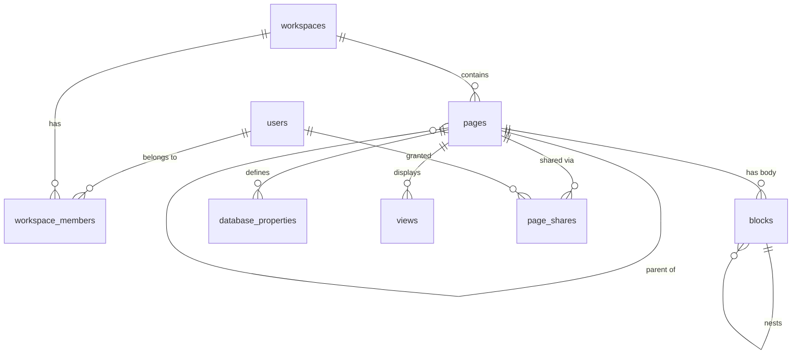

# Domain Research — NoteFlow Workspace

> Source: User-provided research (no Gemini key)
> Created: 2026-07-25T17:29:30.469Z

## Executive Summary

- The product is a Notion-like collaborative workspace: a tree of **pages** whose bodies are ordered
  **blocks**, plus **databases** (structured collections of pages with typed properties and views).
- Recommended stack: **TanStack Start** (full-stack React, file-based routing, server functions) on
  **PostgreSQL 17**, with **Drizzle ORM** for typed schema/migrations and **Zod** for boundary validation.
- The single most important modeling decision is the **block model**: a self-referencing table with
  `parent_id`, a `position` ordering key, a `type` discriminator, and a JSONB `content` payload.
  Everything a user sees in a page body is a block; pages are themselves blocks of type `page`.
- Ordering inside a parent should use a **fractional index** (lexicographic string key) so a drag-and-drop
  reorder writes exactly one row instead of renumbering siblings.
- Rich text is stored as an array of **inline runs** (`{ text, annotations, link }`), not as HTML. This
  keeps the payload renderer-agnostic and makes search indexing straightforward.
- Databases are pages with a `schema` of typed properties (`text`, `number`, `select`, `multi_select`,
  `date`, `checkbox`, `url`, `relation`). Rows are pages whose `properties` JSONB conforms to that schema.
- Views (table, board, list) are saved query configurations — filters, sorts, visible properties, and a
  `group_by` for board views. Views must not duplicate row data.
- Permissions in a v1 scope: workspace membership with roles (`owner`, `member`, `guest`) and per-page
  sharing overrides. Effective permission = nearest ancestor override, else workspace role.
- Full-text search over block plain text via a Postgres `tsvector` generated column and a GIN index.
- Soft deletion ("trash") is required: `deleted_at` on pages/blocks, restorable, purged separately.
- Slash-command block insertion, backlinks (`page mention` inline runs), and breadcrumbs are the
  table-stakes interactions users expect from this product category.

## Architecture Research

### Framework

TanStack Start is the default choice: a single TypeScript project serving both the React UI and typed
server functions, with file-based routing and streaming SSR. Server functions remove the need for a
hand-written REST layer for internal calls, while still allowing explicit API routes where a public
contract is wanted.

Alternatives considered: Next.js App Router (heavier, RSC model complicates optimistic block editing),
Remix (good, but fewer typed-RPC ergonomics), SPA + separate Express API (more moving parts, duplicated
validation).

### Layering

```
routes/            UI routes + server functions (thin: auth, validation, delegate)
  services/          business rules (page tree ops, block ordering, view queries)
  repositories/      Drizzle queries — the ONLY place SQL lives
  db/schema.ts       Drizzle table definitions + relations
  lib/               fractional-index, rich-text, permissions
```

Rule: routes never touch the database directly; services never build SQL strings; repositories never
enforce authorization. Each layer is unit-testable in isolation.

### Editing and consistency

v1 targets **last-write-wins per block** with optimistic UI. Block-level granularity keeps conflicts rare
because two users editing different paragraphs touch different rows. Real-time CRDT sync (Yjs) is an
explicit non-goal for v1 but the block model does not preclude it later.

### Security posture

- Session cookies, `httpOnly` + `sameSite=lax`; password hashing with argon2id.
- Every server function re-checks permission on the target page — never trust a client-supplied role.
- Validate all input with Zod at the server-function boundary; reject unknown block types.
- Parameterized queries only (Drizzle handles this); no string-built SQL.

## Domain Knowledge

### Actors

| Actor | Capability |
|---|---|
| Workspace owner | Manage members, billing, delete workspace |
| Member | Create/edit/delete pages they can access, create databases |
| Guest | Access only explicitly shared pages |

### Core workflows

1. **Create a page** — appears in the sidebar tree under its parent, opens with an empty paragraph block.
2. **Edit a page body** — typing in a block updates that block; `Enter` splits into a new block;
   `Backspace` at offset 0 merges into the previous block; `Tab`/`Shift+Tab` re-parents for nesting.
3. **Slash command** — typing `/` opens a block-type picker (heading, list, todo, quote, code, divider).
4. **Drag to reorder** — moves a block within or across parents; writes one new position key.
5. **Create a database** — define properties, then add rows; switch between table/board/list views.
6. **Filter & sort a view** — saved on the view, not per-user, in v1.
7. **Search** — full-text across page titles and block text within the workspace.
8. **Trash and restore** — deleting a page soft-deletes its whole subtree; restore brings it back.

### Business rules

- A page's parent must be a page or the workspace root; a page can never be its own ancestor
  (move operations must reject cycles).
- Deleting a page soft-deletes descendants; restoring restores only if the parent is not deleted,
  otherwise the page is restored to the workspace root.
- Property values must conform to the database's declared property type; changing a property's type
  requires an explicit migration of existing values (v1: allowed only when the column is empty).
- `select`/`multi_select` values must be drawn from the property's declared options.
- Block `position` is unique within a parent.
- Title is not a block: it is a first-class column on the page so the sidebar and search do not need to
  read the body.

### Edge cases

- Empty page (no blocks) must still render an editable placeholder.
- Very deep nesting — cap at a documented depth (e.g. 10) and reject beyond it.
- Concurrent reorder of the same block: fractional index collision resolved by regenerating the key.
- Relation properties pointing at deleted rows must render as "unresolved" rather than crashing.
- A view whose `group_by` property was deleted falls back to ungrouped.

## Entity Relationships & Data

Target: PostgreSQL 17.

- `users` — id, email (unique), password_hash, display_name, created_at
- `workspaces` — id, name, slug (unique), owner_id → users, created_at
- `workspace_members` — workspace_id, user_id, role (`owner|member|guest`); PK (workspace_id, user_id)
- `pages` — id, workspace_id, parent_page_id (nullable, self-ref), title, icon, is_database (bool),
  database_id (nullable → pages), properties (jsonb), position (text), created_by, created_at,
  updated_at, deleted_at (nullable)
- `blocks` — id, page_id → pages, parent_block_id (nullable, self-ref), type, content (jsonb),
  position (text), created_at, updated_at, deleted_at (nullable)
- `database_properties` — id, database_page_id → pages, name, type, options (jsonb), position
- `views` — id, database_page_id → pages, name, kind (`table|board|list`), filters (jsonb),
  sorts (jsonb), group_by_property_id (nullable), visible_properties (jsonb), position
- `page_shares` — page_id, user_id, permission (`read|write`); PK (page_id, user_id)

Indexes: `pages(workspace_id, parent_page_id)`, `pages(database_id)`, `blocks(page_id, position)`,
`blocks(parent_block_id)`, GIN on `blocks.content` and on the generated `search_vector`.

Normalization guidance: keep *structure* relational (parentage, ordering, membership) and keep
*presentation payloads* (rich-text runs, view filter trees) in JSONB. Do not put block ordering inside
JSONB — reordering must be a single indexed column write.


