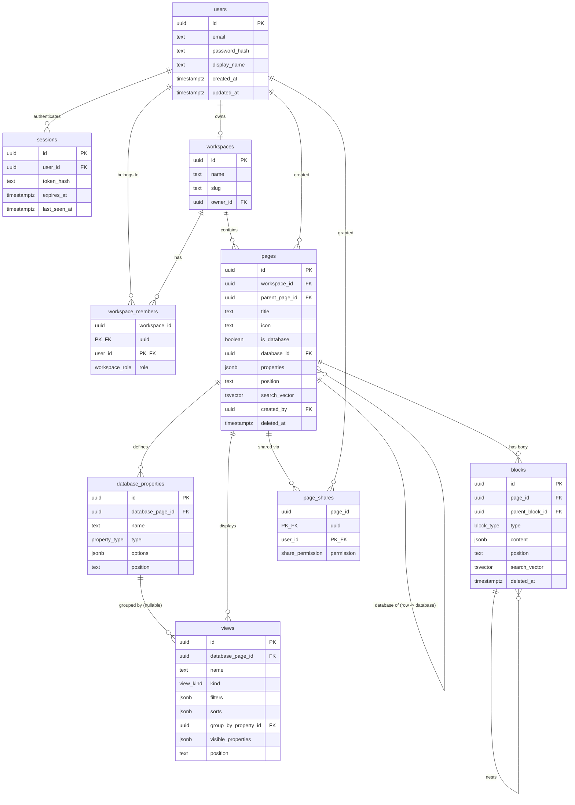

# Database — NoteFlow Workspace

## Overview

- **Engine:** PostgreSQL 17, accessed through `postgres-js` and Drizzle ORM (per Architecture). No third-party extensions are required — `gen_random_uuid()` has been a built-in PostgreSQL function since v13, and full-text search uses core `tsvector`/`to_tsvector`/`websearch_to_tsquery`, so no `pgcrypto`, `citext`, or `pg_trgm` install step is needed for v1. (`pg_trgm` is a plausible future addition for fuzzy/typo-tolerant search; not required now.)
- **Connection strategy:** a single `postgres-js` connection pool is created once in `src/server/container.ts` (per Architecture's `getContainer()` lazy singleton) and reused for the process lifetime. Repositories receive the Drizzle client via constructor injection; no module outside `container.ts` opens a connection.
- **Migration approach:** schema-first with `drizzle-kit`. `src/server/db/schema.ts` is the single source of truth for table shape; `drizzle-kit generate` produces timestamped SQL files under `drizzle/migrations/` that are committed and reviewed in PRs (never hand-edited after generation); `drizzle-kit migrate` applies them at deploy time and in the test-database bootstrap. The **DDL block below is the canonical shape** the first generated migration must produce — drizzle-kit's generated SQL is expected to match it column-for-column.
- **Primary keys:** UUIDv4 (`gen_random_uuid()`) everywhere except pure join tables, which use composite primary keys. UUIDs avoid leaking row counts/creation order through the API and let the client generate optimistic IDs for the block editor if ever needed later.
- **Soft delete:** `pages` and `blocks` carry `deleted_at timestamptz NULL`. Nothing is hard-deleted by application code in v1 ("purged separately" per research is explicitly out of scope for v1 routes); FK `ON DELETE CASCADE`/`SET NULL` behavior below exists only to keep the schema consistent if a purge job is added later, and is never triggered by normal app flows.
- **Ordering:** `pages.position` and `blocks.position` are opaque `text` fractional-index keys produced by `lib/fractional-index` (base-62 lexicographic). The database only needs to sort by them and enforce per-parent uniqueness — it does not interpret their content.
- **JSONB usage:** confined to (a) rich-text payloads (`blocks.content`), (b) database row values (`pages.properties`), (c) database property option lists (`database_properties.options`), and (d) view configuration (`views.filters`, `views.sorts`, `views.visible_properties`) — exactly the "presentation payloads" the research says belong in JSONB. Structure (parentage, ordering, membership, sharing) is always relational columns, per the research's normalization guidance.
- **Property types (v1 scope decision):** the objectives' must-have list is authoritative: `text | number | select | multi_select | date | checkbox | url`. The research's architecture notes also mention a `relation` type and the edge case "relation properties pointing at deleted rows render as unresolved" — that type is **not** implemented in this schema because it is outside the v1 must-have list; the edge case is recorded here as a forward-compatibility note for whoever adds `relation` later (the `property_type` enum below is the single place to extend, and `page_shares`/`pages` already give a relation type a natural target: another row-page's `id`).
- **Authorization boundary:** the database enforces referential integrity and uniqueness only. Permission checks (`assertCan`) happen exclusively in `PermissionService` before a repository call is made, per Architecture — no row-level security policies are used in v1, since every access path is already mediated by `withAppContext`.

## Data Models

### `users`

| Column | Type | Constraints / Default |
|---|---|---|
| `id` | `uuid` | PK, default `gen_random_uuid()` |
| `email` | `text` | `NOT NULL` |
| `password_hash` | `text` | `NOT NULL` — argon2id hash, never plaintext |
| `display_name` | `text` | `NOT NULL` |
| `created_at` | `timestamptz` | `NOT NULL`, default `now()` |
| `updated_at` | `timestamptz` | `NOT NULL`, default `now()`, trigger-maintained |

- **Uniqueness:** `UNIQUE` index on `lower(email)` — email comparison/lookup is case-insensitive; the column preserves the case the user typed.
- **Indexes:** the case-insensitive unique index above serves login lookups directly.

### `sessions`

| Column | Type | Constraints / Default |
|---|---|---|
| `id` | `uuid` | PK, default `gen_random_uuid()` |
| `user_id` | `uuid` | `NOT NULL`, FK → `users(id)` `ON DELETE CASCADE` |
| `token_hash` | `text` | `NOT NULL` — SHA-256 of the opaque session token; the raw token lives only in the signed cookie, never in the DB |
| `created_at` | `timestamptz` | `NOT NULL`, default `now()` |
| `expires_at` | `timestamptz` | `NOT NULL` |
| `last_seen_at` | `timestamptz` | `NOT NULL`, default `now()` |

- **Uniqueness:** `UNIQUE(token_hash)`.
- **Indexes:** `(user_id)` for `logout`/"revoke all sessions"; `(expires_at)` for an expiry-sweep job.

### `workspaces`

| Column | Type | Constraints / Default |
|---|---|---|
| `id` | `uuid` | PK, default `gen_random_uuid()` |
| `name` | `text` | `NOT NULL` |
| `slug` | `text` | `NOT NULL` |
| `owner_id` | `uuid` | `NOT NULL`, FK → `users(id)` `ON DELETE RESTRICT` |
| `created_at` | `timestamptz` | `NOT NULL`, default `now()` |
| `updated_at` | `timestamptz` | `NOT NULL`, default `now()`, trigger-maintained |

- **Uniqueness:** `UNIQUE(slug)` (URL routing key, `/workspace/$slug`).
- **Indexes:** `(owner_id)`.
- `ON DELETE RESTRICT` on `owner_id`: a user who owns a workspace cannot be hard-deleted without first transferring ownership — matches "no destructive cascades through an owned aggregate" and there is no user-deletion route in v1 anyway.

### `workspace_members`

| Column | Type | Constraints / Default |
|---|---|---|
| `workspace_id` | `uuid` | `NOT NULL`, FK → `workspaces(id)` `ON DELETE CASCADE` |
| `user_id` | `uuid` | `NOT NULL`, FK → `users(id)` `ON DELETE CASCADE` |
| `role` | `workspace_role` (enum: `owner`,`member`,`guest`) | `NOT NULL`, default `'member'` |
| `created_at` | `timestamptz` | `NOT NULL`, default `now()` |

- **Primary key:** `(workspace_id, user_id)`.
- **Indexes:** `(user_id)` — drives `listWorkspacesForUser`.

### `pages`

| Column | Type | Constraints / Default |
|---|---|---|
| `id` | `uuid` | PK, default `gen_random_uuid()` |
| `workspace_id` | `uuid` | `NOT NULL`, FK → `workspaces(id)` `ON DELETE CASCADE` |
| `parent_page_id` | `uuid` | `NULL`, FK → `pages(id)` `ON DELETE CASCADE` |
| `title` | `text` | `NOT NULL`, default `''` |
| `icon` | `text` | `NULL` |
| `is_database` | `boolean` | `NOT NULL`, default `false` |
| `database_id` | `uuid` | `NULL`, FK → `pages(id)` `ON DELETE SET NULL` — set when this page is a *row* of the database page it references |
| `properties` | `jsonb` | `NOT NULL`, default `'{}'` — row property values; meaningful only when `database_id IS NOT NULL` |
| `position` | `text` | `NOT NULL` — fractional index among siblings |
| `search_vector` | `tsvector` | generated, stored (see DDL) — indexes `title` only, per research ("sidebar and search do not need to read the body") |
| `created_by` | `uuid` | `NOT NULL`, FK → `users(id)` `ON DELETE RESTRICT` |
| `created_at` | `timestamptz` | `NOT NULL`, default `now()` |
| `updated_at` | `timestamptz` | `NOT NULL`, default `now()`, trigger-maintained |
| `deleted_at` | `timestamptz` | `NULL` — soft-delete marker (trash) |

- **Checks:** `id <> parent_page_id`, `id <> database_id` (a page cannot be its own parent or its own database — true cycle prevention beyond this single-row check is enforced in `PageTreeService.movePage` via a recursive-CTE ancestor walk, since the database cannot see a multi-hop cycle at insert/update time).
- **Uniqueness of `position`:** split into two partial unique indexes because `parent_page_id IS NULL` (workspace-root pages) must still collide-check against each other even though NULL≠NULL under a plain composite unique constraint:
  - `UNIQUE (workspace_id, parent_page_id, position) WHERE parent_page_id IS NOT NULL AND deleted_at IS NULL`
  - `UNIQUE (workspace_id, position) WHERE parent_page_id IS NULL AND deleted_at IS NULL`
  - Trashed pages are excluded so restoring/creating can reuse a position without colliding with a page sitting in the trash.
- **Indexes:** `(workspace_id, parent_page_id)` (tree traversal / sidebar), `(database_id)` (row lookup for a database), GIN on `search_vector`, `(workspace_id) WHERE deleted_at IS NOT NULL` (trash listing).
- **Depth cap (10):** enforced in `BlockService`/`PageTreeService` via a recursive-CTE depth count on write, not a DB constraint — Postgres has no native "max recursion depth" check expressible as a `CHECK`.

### `blocks`

| Column | Type | Constraints / Default |
|---|---|---|
| `id` | `uuid` | PK, default `gen_random_uuid()` |
| `page_id` | `uuid` | `NOT NULL`, FK → `pages(id)` `ON DELETE CASCADE` |
| `parent_block_id` | `uuid` | `NULL`, FK → `blocks(id)` `ON DELETE CASCADE` |
| `type` | `block_type` (enum, see DDL) | `NOT NULL` |
| `content` | `jsonb` | `NOT NULL`, default `'{}'` — type-specific payload (`runs: InlineRun[]` for text-bearing types, plus `checked: boolean` for `to_do`, `language: text` for `code`; `divider` stores `{}`) |
| `position` | `text` | `NOT NULL` — fractional index among sibling blocks |
| `search_vector` | `tsvector` | generated, stored from `content` via `block_content_to_text()` (see DDL) |
| `created_at` | `timestamptz` | `NOT NULL`, default `now()` |
| `updated_at` | `timestamptz` | `NOT NULL`, default `now()`, trigger-maintained |
| `deleted_at` | `timestamptz` | `NULL` |

- **Checks:** `id <> parent_block_id`.
- **Uniqueness of `position`:** same split-partial-index pattern as `pages`, scoped by `page_id`:
  - `UNIQUE (page_id, parent_block_id, position) WHERE parent_block_id IS NOT NULL AND deleted_at IS NULL`
  - `UNIQUE (page_id, position) WHERE parent_block_id IS NULL AND deleted_at IS NULL`
- **Indexes:** `(page_id, position)` (ordered body fetch), `(parent_block_id)` (nested-children fetch), GIN on `search_vector`.

### `database_properties`

| Column | Type | Constraints / Default |
|---|---|---|
| `id` | `uuid` | PK, default `gen_random_uuid()` |
| `database_page_id` | `uuid` | `NOT NULL`, FK → `pages(id)` `ON DELETE CASCADE` |
| `name` | `text` | `NOT NULL` |
| `type` | `property_type` (enum: `text`,`number`,`select`,`multi_select`,`date`,`checkbox`,`url`) | `NOT NULL` |
| `options` | `jsonb` | `NOT NULL`, default `'[]'` — `[{id, label, color}]`, populated only for `select`/`multi_select` |
| `position` | `text` | `NOT NULL` — column ordering |
| `created_at` | `timestamptz` | `NOT NULL`, default `now()` |
| `updated_at` | `timestamptz` | `NOT NULL`, default `now()`, trigger-maintained |

- **Uniqueness:** `UNIQUE(database_page_id, name)` (no two columns with the same name on one database), `UNIQUE(database_page_id, position)`.
- **Indexes:** `(database_page_id)`.
- Rows are hard-deleted by `deleteProperty` (no soft-delete column) — property *definitions* are metadata, not user content subject to trash/restore; the resulting dangling `views.group_by_property_id` is handled by `ON DELETE SET NULL` (see `views` below), matching the documented edge case ("a view whose `group_by` property was deleted falls back to ungrouped").

### `views`

| Column | Type | Constraints / Default |
|---|---|---|
| `id` | `uuid` | PK, default `gen_random_uuid()` |
| `database_page_id` | `uuid` | `NOT NULL`, FK → `pages(id)` `ON DELETE CASCADE` |
| `name` | `text` | `NOT NULL` |
| `kind` | `view_kind` (enum: `table`,`board`,`list`) | `NOT NULL` |
| `filters` | `jsonb` | `NOT NULL`, default `'[]'` |
| `sorts` | `jsonb` | `NOT NULL`, default `'[]'` |
| `group_by_property_id` | `uuid` | `NULL`, FK → `database_properties(id)` `ON DELETE SET NULL` |
| `visible_properties` | `jsonb` | `NOT NULL`, default `'[]'` |
| `position` | `text` | `NOT NULL` — tab/view ordering |
| `created_at` | `timestamptz` | `NOT NULL`, default `now()` |
| `updated_at` | `timestamptz` | `NOT NULL`, default `now()`, trigger-maintained |

- **Uniqueness:** `UNIQUE(database_page_id, position)`.
- **Indexes:** `(database_page_id)`, `(group_by_property_id)` (cheap lookup when a property is about to be deleted, to know which views need re-checking — the FK's `SET NULL` already handles data integrity; the index just makes that check fast if the app wants to warn the user first).

### `page_shares`

| Column | Type | Constraints / Default |
|---|---|---|
| `page_id` | `uuid` | `NOT NULL`, FK → `pages(id)` `ON DELETE CASCADE` |
| `user_id` | `uuid` | `NOT NULL`, FK → `users(id)` `ON DELETE CASCADE` |
| `permission` | `share_permission` (enum: `read`,`write`) | `NOT NULL` |
| `created_at` | `timestamptz` | `NOT NULL`, default `now()` |

- **Primary key:** `(page_id, user_id)`.
- **Indexes:** `(user_id)` — drives "pages shared with me".

## Entity Relationship Diagram



## DDL

```sql
-- =========================================================================
-- NoteFlow Workspace — PostgreSQL 17 schema
-- Dependency order: enums -> functions -> users -> sessions -> workspaces
-- -> workspace_members -> pages -> blocks -> database_properties -> views
-- -> page_shares -> triggers
-- gen_random_uuid() is a PostgreSQL 13+ builtin; no extensions required.
-- =========================================================================

-- ---------- Enums ----------

CREATE TYPE workspace_role AS ENUM ('owner', 'member', 'guest');
CREATE TYPE share_permission AS ENUM ('read', 'write');
CREATE TYPE property_type AS ENUM ('text', 'number', 'select', 'multi_select', 'date', 'checkbox', 'url');
CREATE TYPE view_kind AS ENUM ('table', 'board', 'list');
CREATE TYPE block_type AS ENUM (
  'paragraph',
  'heading_1',
  'heading_2',
  'heading_3',
  'bulleted_list_item',
  'numbered_list_item',
  'to_do',
  'quote',
  'code',
  'divider'
);

-- ---------- Shared functions ----------

CREATE OR REPLACE FUNCTION set_updated_at() RETURNS trigger
LANGUAGE plpgsql AS $$
BEGIN
  NEW.updated_at = now();
  RETURN NEW;
END;
$$;

-- Extracts plain text from a block's rich-text runs so it can feed a
-- generated tsvector column. Must be IMMUTABLE to be usable in a
-- GENERATED ALWAYS AS ... STORED expression. Blocks without runs
-- (e.g. divider) simply index to an empty vector.
CREATE OR REPLACE FUNCTION block_content_to_text(content jsonb) RETURNS text
LANGUAGE sql IMMUTABLE PARALLEL SAFE AS $$
  SELECT COALESCE(
    string_agg(elem ->> 'text', ' '),
    ''
  )
  FROM jsonb_array_elements(COALESCE(content -> 'runs', '[]'::jsonb)) AS elem;
$$;

-- ---------- users ----------

CREATE TABLE users (
  id            uuid PRIMARY KEY DEFAULT gen_random_uuid(),
  email         text NOT NULL,
  password_hash text NOT NULL,
  display_name  text NOT NULL,
  created_at    timestamptz NOT NULL DEFAULT now(),
  updated_at    timestamptz NOT NULL DEFAULT now()
);

CREATE UNIQUE INDEX users_email_unique ON users (lower(email));

CREATE TRIGGER users_set_updated_at
  BEFORE UPDATE ON users
  FOR EACH ROW EXECUTE FUNCTION set_updated_at();

-- ---------- sessions ----------

CREATE TABLE sessions (
  id            uuid PRIMARY KEY DEFAULT gen_random_uuid(),
  user_id       uuid NOT NULL REFERENCES users (id) ON DELETE CASCADE,
  token_hash    text NOT NULL,
  created_at    timestamptz NOT NULL DEFAULT now(),
  expires_at    timestamptz NOT NULL,
  last_seen_at  timestamptz NOT NULL DEFAULT now()
);

CREATE UNIQUE INDEX sessions_token_hash_unique ON sessions (token_hash);
CREATE INDEX sessions_user_id_idx ON sessions (user_id);
CREATE INDEX sessions_expires_at_idx ON sessions (expires_at);

-- ---------- workspaces ----------

CREATE TABLE workspaces (
  id         uuid PRIMARY KEY DEFAULT gen_random_uuid(),
  name       text NOT NULL,
  slug       text NOT NULL,
  owner_id   uuid NOT NULL REFERENCES users (id) ON DELETE RESTRICT,
  created_at timestamptz NOT NULL DEFAULT now(),
  updated_at timestamptz NOT NULL DEFAULT now()
);

CREATE UNIQUE INDEX workspaces_slug_unique ON workspaces (slug);
CREATE INDEX workspaces_owner_id_idx ON workspaces (owner_id);

CREATE TRIGGER workspaces_set_updated_at
  BEFORE UPDATE ON workspaces
  FOR EACH ROW EXECUTE FUNCTION set_updated_at();

-- ---------- workspace_members ----------

CREATE TABLE workspace_members (
  workspace_id uuid NOT NULL REFERENCES workspaces (id) ON DELETE CASCADE,
  user_id      uuid NOT NULL REFERENCES users (id) ON DELETE CASCADE,
  role         workspace_role NOT NULL DEFAULT 'member',
  created_at   timestamptz NOT NULL DEFAULT now(),
  PRIMARY KEY (workspace_id, user_id)
);

CREATE INDEX workspace_members_user_id_idx ON workspace_members (user_id);

-- ---------- pages ----------

CREATE TABLE pages (
  id             uuid PRIMARY KEY DEFAULT gen_random_uuid(),
  workspace_id   uuid NOT NULL REFERENCES workspaces (id) ON DELETE CASCADE,
  parent_page_id uuid REFERENCES pages (id) ON DELETE CASCADE,
  title          text NOT NULL DEFAULT '',
  icon           text,
  is_database    boolean NOT NULL DEFAULT false,
  database_id    uuid REFERENCES pages (id) ON DELETE SET NULL,
  properties     jsonb NOT NULL DEFAULT '{}'::jsonb,
  position       text NOT NULL,
  search_vector  tsvector GENERATED ALWAYS AS (to_tsvector('english', coalesce(title, ''))) STORED,
  created_by     uuid NOT NULL REFERENCES users (id) ON DELETE RESTRICT,
  created_at     timestamptz NOT NULL DEFAULT now(),
  updated_at     timestamptz NOT NULL DEFAULT now(),
  deleted_at     timestamptz,
  CONSTRAINT pages_not_own_parent CHECK (id <> parent_page_id),
  CONSTRAINT pages_not_own_database CHECK (id <> database_id)
);

CREATE INDEX pages_workspace_parent_idx ON pages (workspace_id, parent_page_id);
CREATE INDEX pages_database_id_idx ON pages (database_id);
CREATE INDEX pages_trash_idx ON pages (workspace_id) WHERE deleted_at IS NOT NULL;
CREATE INDEX pages_search_vector_idx ON pages USING GIN (search_vector);

CREATE UNIQUE INDEX pages_position_unique_nested
  ON pages (workspace_id, parent_page_id, position)
  WHERE parent_page_id IS NOT NULL AND deleted_at IS NULL;

CREATE UNIQUE INDEX pages_position_unique_root
  ON pages (workspace_id, position)
  WHERE parent_page_id IS NULL AND deleted_at IS NULL;

CREATE TRIGGER pages_set_updated_at
  BEFORE UPDATE ON pages
  FOR EACH ROW EXECUTE FUNCTION set_updated_at();

-- ---------- blocks ----------

CREATE TABLE blocks (
  id               uuid PRIMARY KEY DEFAULT gen_random_uuid(),
  page_id          uuid NOT NULL REFERENCES pages (id) ON DELETE CASCADE,
  parent_block_id  uuid REFERENCES blocks (id) ON DELETE CASCADE,
  type             block_type NOT NULL,
  content          jsonb NOT NULL DEFAULT '{}'::jsonb,
  position         text NOT NULL,
  search_vector    tsvector GENERATED ALWAYS AS (to_tsvector('english', block_content_to_text(content))) STORED,
  created_at       timestamptz NOT NULL DEFAULT now(),
  updated_at       timestamptz NOT NULL DEFAULT now(),
  deleted_at       timestamptz,
  CONSTRAINT blocks_not_own_parent CHECK (id <> parent_block_id)
);

CREATE INDEX blocks_page_position_idx ON blocks (page_id, position);
CREATE INDEX blocks_parent_block_id_idx ON blocks (parent_block_id);
CREATE INDEX blocks_search_vector_idx ON blocks USING GIN (search_vector);

CREATE UNIQUE INDEX blocks_position_unique_nested
  ON blocks (page_id, parent_block_id, position)
  WHERE parent_block_id IS NOT NULL AND deleted_at IS NULL;

CREATE UNIQUE INDEX blocks_position_unique_root
  ON blocks (page_id, position)
  WHERE parent_block_id IS NULL AND deleted_at IS NULL;

CREATE TRIGGER blocks_set_updated_at
  BEFORE UPDATE ON blocks
  FOR EACH ROW EXECUTE FUNCTION set_updated_at();

-- ---------- database_properties ----------

CREATE TABLE database_properties (
  id                uuid PRIMARY KEY DEFAULT gen_random_uuid(),
  database_page_id  uuid NOT NULL REFERENCES pages (id) ON DELETE CASCADE,
  name              text NOT NULL,
  type              property_type NOT NULL,
  options           jsonb NOT NULL DEFAULT '[]'::jsonb,
  position          text NOT NULL,
  created_at        timestamptz NOT NULL DEFAULT now(),
  updated_at        timestamptz NOT NULL DEFAULT now()
);

CREATE UNIQUE INDEX database_properties_name_unique ON database_properties (database_page_id, name);
CREATE UNIQUE INDEX database_properties_position_unique ON database_properties (database_page_id, position);
CREATE INDEX database_properties_database_page_id_idx ON database_properties (database_page_id);

CREATE TRIGGER database_properties_set_updated_at
  BEFORE UPDATE ON database_properties
  FOR EACH ROW EXECUTE FUNCTION set_updated_at();

-- ---------- views ----------

CREATE TABLE views (
  id                     uuid PRIMARY KEY DEFAULT gen_random_uuid(),
  database_page_id       uuid NOT NULL REFERENCES pages (id) ON DELETE CASCADE,
  name                   text NOT NULL,
  kind                   view_kind NOT NULL,
  filters                jsonb NOT NULL DEFAULT '[]'::jsonb,
  sorts                  jsonb NOT NULL DEFAULT '[]'::jsonb,
  group_by_property_id   uuid REFERENCES database_properties (id) ON DELETE SET NULL,
  visible_properties     jsonb NOT NULL DEFAULT '[]'::jsonb,
  position               text NOT NULL,
  created_at             timestamptz NOT NULL DEFAULT now(),
  updated_at             timestamptz NOT NULL DEFAULT now()
);

CREATE UNIQUE INDEX views_position_unique ON views (database_page_id, position);
CREATE INDEX views_database_page_id_idx ON views (database_page_id);
CREATE INDEX views_group_by_property_id_idx ON views (group_by_property_id);

CREATE TRIGGER views_set_updated_at
  BEFORE UPDATE ON views
  FOR EACH ROW EXECUTE FUNCTION set_updated_at();

-- ---------- page_shares ----------

CREATE TABLE page_shares (
  page_id     uuid NOT NULL REFERENCES pages (id) ON DELETE CASCADE,
  user_id     uuid NOT NULL REFERENCES users (id) ON DELETE CASCADE,
  permission  share_permission NOT NULL,
  created_at  timestamptz NOT NULL DEFAULT now(),
  PRIMARY KEY (page_id, user_id)
);

CREATE INDEX page_shares_user_id_idx ON page_shares (user_id);
```

## Seed & Fixture Strategy

- **Production:** no seed data ships to production. Every route performs its real function against user-created rows (per objectives' "no mock data" constraint) — there is no "demo workspace" auto-created for a new deployment.
- **Local development:** `pnpm -C <app> db:seed` runs a standalone script (`src/server/db/seed.ts`, never imported by route code) that creates one demo user, one workspace with that user as `owner`, a handful of nested pages with a few blocks each, and one example database (with `database_properties` + a table and a board `view`) so the editor and views have something to render immediately after `drizzle-kit push`. The script is idempotent (checks for the demo user's email before inserting) so it can be re-run safely.
- **Automated tests:** two layers, matching the CLAUDE.md testing policy of never spawning real external processes but validating real behavior:
  - **Pure logic** (`lib/fractional-index`, `lib/rich-text`, `lib/permission-rules`) — no database at all; table-driven unit tests on plain input/output.
  - **Repositories and services** — run against a real local PostgreSQL 17 instance (the same Docker Postgres the app uses in dev), with the schema pushed once per test run via `drizzle-kit push`. Each test wraps its body in `BEGIN ... ROLLBACK` (a shared `withTestTransaction(fn)` test helper) so tests never see each other's writes and no cleanup step is required between tests.
- **Fixtures are factory functions, not static JSON:** `tests/factories/` exports `makeUser(overrides?)`, `makeWorkspace(overrides?)`, `makePage(overrides?)`, `makeBlock(overrides?)`, `makeDatabaseProperty(overrides?)`, `makeView(overrides?)`, each returning the minimal valid row for its table with every field overridable — named for what makes them interesting where relevant (`makePageWithDeepNesting`, `makeBlockAtDepthLimit`, `makeViewWithDeletedGroupByProperty`) so cycle-rejection, depth-cap, and orphaned-`group_by` tests read as intent rather than arbitrary IDs.
- **API-route tests** call the exported `GET`/`POST`/server-function handlers directly against the same transactional test database — no HTTP server is started, matching the "call the exported handler with a `Request`" pattern for route-level tests.

## Query Patterns

1. **Page tree for the sidebar** — one query per workspace, tree assembled in the app layer (parent/child is a handful of levels deep and the whole tree is small enough to hold client-side, avoiding N+1 recursive round-trips):
   ```sql
   SELECT id, parent_page_id, title, icon, is_database, position
   FROM pages
   WHERE workspace_id = $1 AND deleted_at IS NULL
   ORDER BY parent_page_id NULLS FIRST, position;
   ```

2. **Blocks for a page body** — same shape, scoped by `page_id`, feeding `BlockService.listBlocks`:
   ```sql
   SELECT id, parent_block_id, type, content, position
   FROM blocks
   WHERE page_id = $1 AND deleted_at IS NULL
   ORDER BY parent_block_id NULLS FIRST, position;
   ```

3. **Reorder (drag) a page or block** — always a single-row write against the fractional-index column, never a sibling renumber:
   ```sql
   UPDATE blocks SET position = $2, updated_at = now() WHERE id = $1;
   ```

4. **Soft-delete a page and its whole subtree** (`softDeletePage`) — recursive CTE collects descendant ids, then one `UPDATE`:
   ```sql
   WITH RECURSIVE subtree AS (
     SELECT id FROM pages WHERE id = $1
     UNION ALL
     SELECT p.id FROM pages p JOIN subtree s ON p.parent_page_id = s.id
     WHERE p.deleted_at IS NULL
   )
   UPDATE pages SET deleted_at = now(), updated_at = now()
   WHERE id IN (SELECT id FROM subtree);
   ```
   The same CTE shape (against `blocks.parent_block_id`) backs subtree-scoped block operations and depth-limit counting for `indent`/nesting checks.

5. **Restore a page** (`restorePage`) — root-fallback business rule, decided in the service after one lookup:
   ```sql
   SELECT deleted_at FROM pages WHERE id = $1;                          -- check parent
   UPDATE pages
   SET deleted_at = NULL,
       parent_page_id = CASE WHEN $2::boolean THEN NULL ELSE parent_page_id END,  -- $2 = parent is deleted/missing
       position = $3,                                                   -- freshly generated root position when falling back
       updated_at = now()
   WHERE id = $1;
   ```

6. **Ancestor chain for permission resolution** (`PermissionService.getEffectivePermission`) — walk up from a page to collect any `page_shares` override before falling back to workspace role:
   ```sql
   WITH RECURSIVE ancestors AS (
     SELECT id, parent_page_id, workspace_id FROM pages WHERE id = $1
     UNION ALL
     SELECT p.id, p.parent_page_id, p.workspace_id
     FROM pages p JOIN ancestors a ON p.id = a.parent_page_id
   )
   SELECT ps.page_id, ps.permission
   FROM ancestors a
   JOIN page_shares ps ON ps.page_id = a.id AND ps.user_id = $2
   ORDER BY array_position((SELECT array_agg(id) FROM ancestors), a.id);  -- nearest ancestor first
   ```
   The nearest override wins; `lib/permission-rules.resolveEffectivePermission` does the actual decision once this row set (plus the caller's `workspace_members.role`) is loaded — the query only fetches, it never decides.

7. **Database rows for a table view** — `runView` loads rows and applies the view's saved filters/sorts against the `properties` JSONB with `->>`/`->` operators built from the view's typed filter tree; property values are always compared as the type `database_properties.type` declares (e.g. `(properties->>'due_date')::date`):
   ```sql
   SELECT id, title, properties
   FROM pages
   WHERE database_id = $1 AND deleted_at IS NULL
     AND (properties ->> $2) = $3          -- one clause per active filter
   ORDER BY (properties ->> $4);            -- one clause per active sort
   ```

8. **Board view grouping** — same row set, grouped in the app layer by `properties ->> group_by_property_id`; if `views.group_by_property_id` is `NULL` (already nulled by the `ON DELETE SET NULL` FK when its property was deleted), `ViewService` renders a single ungrouped bucket instead of issuing a `GROUP BY` — matching the documented fallback edge case without any special-case SQL.

9. **Full-text search** — two ranked queries (page titles, block text), each already scoped to the workspace; permission filtering happens in `SearchService` per hit via `PermissionService.assertCan('read', ...)` rather than embedded in SQL, keeping the authorization decision in one place per Architecture:
   ```sql
   SELECT id, title, ts_rank(search_vector, query) AS rank
   FROM pages, websearch_to_tsquery('english', $2) AS query
   WHERE workspace_id = $1 AND deleted_at IS NULL AND search_vector @@ query
   ORDER BY rank DESC LIMIT 20;

   SELECT b.id, b.page_id, ts_rank(b.search_vector, query) AS rank
   FROM blocks b
   JOIN pages p ON p.id = b.page_id
   , websearch_to_tsquery('english', $2) AS query
   WHERE p.workspace_id = $1 AND b.deleted_at IS NULL AND p.deleted_at IS NULL
     AND b.search_vector @@ query
   ORDER BY rank DESC LIMIT 20;
   ```

10. **"Shared with me" / share management** — direct index hits, no recursion:
    ```sql
    SELECT ps.page_id, ps.permission, p.title
    FROM page_shares ps JOIN pages p ON p.id = ps.page_id
    WHERE ps.user_id = $1 AND p.deleted_at IS NULL;
    ```