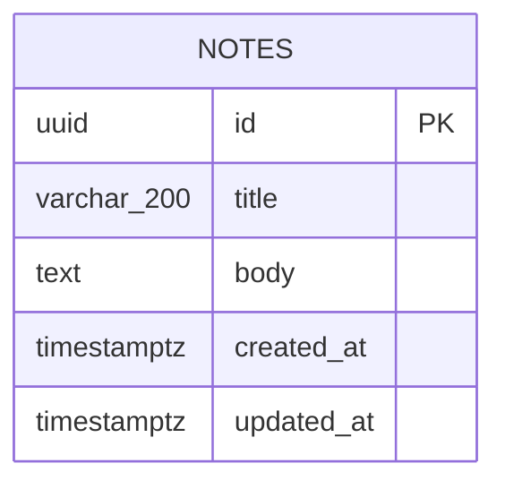

# Database — Quick Notes

## Overview

- **PostgreSQL version:** 14+ (any current PostgreSQL works; `gen_random_uuid()` is available natively from PG13 onward, but the schema explicitly enables `pgcrypto` for portability to slightly older instances).
- **Extensions:** `pgcrypto` — provides `gen_random_uuid()`, used as the default for the `notes.id` primary key.
- **Connection strategy:** a single `pg.Pool` owned by `PostgresNoteStore` (`app/server/postgres-note-store.ts`), constructed once from `DATABASE_URL` and reused for the lifetime of the process. No per-request connections, no read replicas, no connection multiplexer — the app is single-user and small enough that one pool is sufficient. When `DATABASE_URL` is unset, the app runs entirely against `InMemoryNoteStore` and no PostgreSQL connection is attempted (per `NoteStore` contract in Architecture.md).
- **Migration approach:** no migration framework (no Prisma/Knex/node-pg-migrate). A single hand-written DDL file, `app/server/schema.sql`, is the source of truth and is applied manually via `psql -f app/server/schema.sql` before first run against a real database. All statements use `create table if not exists` / `create index if not exists` / `create extension if not exists` so the file is safely re-runnable. There is exactly one table, so schema evolution (if ever needed) would mean hand-editing this file and re-running it — no versioned migration chain is warranted at this scale.

## Data Models

### `notes`

The single entity in the system. One row per note.

| Column | Type | Constraints | Default | Notes |
|---|---|---|---|---|
| `id` | `uuid` | `PRIMARY KEY` | `gen_random_uuid()` | Stable identifier, generated server-side; never supplied by the client on create. |
| `title` | `varchar(200)` | `NOT NULL` | — | 1–200 characters after trimming, enforced by `NoteInputSchema` (Zod) before the row is written; the column length cap is a backstop, not the primary enforcement point. |
| `body` | `text` | `NOT NULL` | `''` | Up to 10,000 characters, enforced by `NoteInputSchema`. `text` has no practical length limit in Postgres, so the 10,000-char rule lives entirely in application validation. |
| `created_at` | `timestamptz` | `NOT NULL` | `now()` | Set once, on insert, by the database default. Never updated thereafter. |
| `updated_at` | `timestamptz` | `NOT NULL` | `now()` | Set on insert; stamped to `now()` by `NotesService`/`PostgresNoteStore` on every update. Drives list ordering. |

**Indexes**

| Index | Columns | Purpose |
|---|---|---|
| `notes_pkey` (implicit) | `id` | Primary key lookup — backs `getNote`, `updateNote`, `deleteNote`. |
| `notes_updated_at_idx` | `updated_at DESC` | Backs the list query's `ORDER BY updated_at DESC`, the only sort the app performs. |

**Foreign keys:** none — single-table schema, no relationships.

**Uniqueness rules:** none beyond the primary key. Titles are not required to be unique (the research and architecture place no such constraint on the domain).

## Entity Relationship Diagram



## DDL

```sql
-- Quick Notes — schema.sql
-- Applied manually via: psql -f app/server/schema.sql
-- Safe to re-run: all statements are idempotent.

create extension if not exists pgcrypto;

create table if not exists notes (
  id uuid primary key default gen_random_uuid(),
  title varchar(200) not null,
  body text not null default '',
  created_at timestamptz not null default now(),
  updated_at timestamptz not null default now()
);

create index if not exists notes_updated_at_idx on notes (updated_at desc);
```

## Seed & Fixture Strategy

- **Local dev / demo without Postgres:** `DATABASE_URL` unset → `InMemoryNoteStore` is used automatically (per `note-store.ts`'s factory), starting empty on every process boot. No seed data is required or provided for this path — the empty-list state is itself one of the UI states the app must render correctly (per the research's edge cases).
- **Local dev against real Postgres:** no seed script is provided. After running `schema.sql`, `notes` starts empty; the developer creates notes through the app's own UI/`createNote` server function. This matches the small-app scope — a seed script would be gold-plating for a single-table demo app.
- **Tests:**
  - `notes-service.test.ts` and `in-memory-note-store.test.ts` run entirely against `InMemoryNoteStore` — no database, no fixtures, each test constructs its own store instance so state never leaks between tests.
  - The optional Postgres-backed contract tests (`describe.skipIf(!process.env.DATABASE_URL)` block mentioned in Architecture.md) truncate the `notes` table at the start of each test (`truncate table notes restart identity`) rather than relying on pre-seeded fixture rows, keeping tests independent of any seed data and safe to run repeatedly against the same database.
  - No fixture files (JSON/SQL) are checked in — every test creates the rows it needs via `store.create(...)` inline, which is sufficient given the schema has only two meaningful input fields (`title`, `body`).

## Query Patterns

All queries are issued exclusively from `PostgresNoteStore`, using parameterized queries via `pg` (no string concatenation).

| Operation | Server function | SQL shape | Index used |
|---|---|---|---|
| List all notes, most recently updated first | `listNotes` | `select id, title, body, created_at, updated_at from notes order by updated_at desc` | `notes_updated_at_idx` |
| Fetch one note by id | `getNote` | `select id, title, body, created_at, updated_at from notes where id = $1` | `notes_pkey` |
| Create a note | `createNote` | `insert into notes (title, body) values ($1, $2) returning id, title, body, created_at, updated_at` | `notes_pkey` (on the returning row) |
| Update a note | `updateNote` | `update notes set title = $1, body = $2, updated_at = now() where id = $3 returning id, title, body, created_at, updated_at` | `notes_pkey` |
| Delete a note | `deleteNote` | `delete from notes where id = $1` | `notes_pkey` |

Notes on access patterns:
- The list query is the only one that scans more than a single row; `notes_updated_at_idx` lets Postgres satisfy the `ORDER BY` without a sort step as the table grows.
- Update and delete both key off `id`, so they're always single-row index lookups via the primary key.
- No pagination, filtering, or search predicates exist in any query, consistent with the scope decision to exclude search/tags/pagination.
- `updated_at` is always set by the application (`now()` at write time in `NotesService`/`PostgresNoteStore`), never left to drift from a stale client-supplied timestamp.