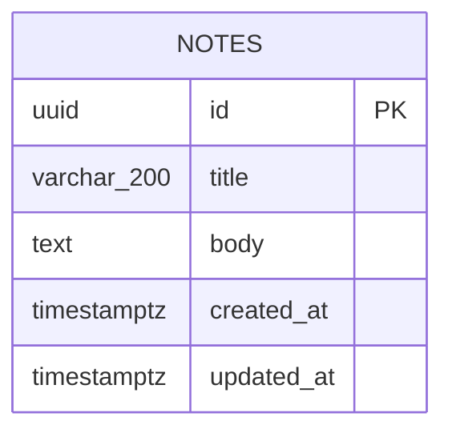

# Domain Research — Quick Notes

> Source: User-provided research (no Gemini key)
> Created: 2026-07-23T09:22:50.243Z

## Executive Summary

- Quick Notes is a minimal CRUD note-taking web app: title + body notes with timestamps, stored in PostgreSQL.
- No framework is mandated by the stakeholders; choose the best default full-stack React framework.
- Single-user, no authentication, no multi-tenancy. Keep it deliberately small.

## Architecture Research

- A full-stack React framework with file-based routing and server functions is ideal so the app needs no separate API server.
- Server functions handle the CRUD operations directly against PostgreSQL using the `pg` driver (no ORM needed at this scale).
- Vite-based tooling preferred for fast builds. Vitest for unit tests.
- The app must run with `npm run dev`, build with `npm run build`, and tests with `npm test`.
- Configuration via environment variable DATABASE_URL; when it is absent, the app should degrade gracefully to an in-memory store so the UI still works (useful for demo/test environments without a database).

## Domain Knowledge

- Actors: a single note author.
- Workflows: create note → appears at top of list; edit note updates updated_at; delete removes it permanently.
- Business rules: title required (1-200 chars); body optional (max 10,000 chars); list ordered by updated_at descending.
- Edge cases: empty list state; very long bodies truncated in list view; concurrent edits are out of scope.

## Entity Relationships & Data

Single entity.

- Table `notes`: id uuid primary key default gen_random_uuid(); title varchar(200) not null; body text not null default ''; created_at timestamptz not null default now(); updated_at timestamptz not null default now().
- Index on updated_at desc for the list query.
