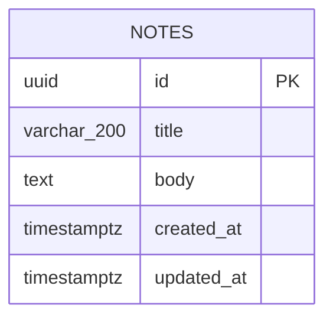

# Database — Quick Notes

## Overview

- **PostgreSQL version:** 14+ (targets PostgreSQL 15 as the reference version; any version supporting `gen_random_uuid()` via the `pgcrypto` extension works).
- **Extensions:** `pgcrypto` — required to provide `gen_random_uuid()` for the `id` primary key default. Enabled once via `CREATE EXTENSION IF NOT EXISTS pgcrypto;` in the DDL/bootstrap step.
- **Connection strategy:** a single shared `pg.Pool`, owned exclusively by `src/server/db-client.ts::getPool()`. The pool is constructed lazily from `DATABASE_URL` (via `config.ts`) and memoized as a module-level singleton — one pool per server process, reused across all requests/server functions. When `DATABASE_URL` is unset, `getPool()` returns `null` and `NoteService` falls back to `InMemoryNoteRepository`, so no connection is attempted. No per-request connections; `pg` handles connection reuse/checkout internally.
- **Migration approach:** no migration framework (appropriate at this scale — a single table). Schema is idempotently bootstrapped at server startup by `db-client.ts::ensureSchema(pool)`, which runs the DDL below using `CREATE EXTENSION IF NOT EXISTS`, `CREATE TABLE IF NOT EXISTS`, and `CREATE INDEX IF NOT EXISTS`. The DDL block in this document is the source of truth; any future schema change is made by editing that block and re-running it (safe/idempotent), rather than versioned migration files.

## Data Models

### `notes`

Single entity in the system — stores every user note.

| Column | Type | Constraints | Default | Notes |
|---|---|---|---|---|
| `id` | `uuid` | `PRIMARY KEY` | `gen_random_uuid()` | Stable note identifier, generated server-side. |
| `title` | `varchar(200)` | `NOT NULL` | — | Enforced 1–200 chars at the application layer (`NoteService`); column cap is 200. |
| `body` | `text` | `NOT NULL` | `''` | App layer caps at 10,000 chars; column itself is unbounded `text`. |
| `created_at` | `timestamptz` | `NOT NULL` | `now()` | Set once on insert; never updated. |
| `updated_at` | `timestamptz` | `NOT NULL` | `now()` | Bumped by the app on every edit; drives list ordering. |

**Indexes:**

| Index | Columns | Type | Purpose |
|---|---|---|---|
| `notes_pkey` | `id` | B-tree (implicit, from PK) | Point lookups (`findById`), uniqueness. |
| `notes_updated_at_idx` | `updated_at DESC` | B-tree | Serves the list query's `ORDER BY updated_at DESC` without a sort. |

**Foreign keys:** none — single-table schema, no relationships.

**Uniqueness rules:** only `id` is unique (via primary key). No uniqueness constraint on `title` — duplicate titles are permitted per the domain research (no such rule stated).

## Entity Relationship Diagram



## DDL

```sql
-- Quick Notes — schema source of truth.
-- Idempotent: safe to run on every server startup (see db-client.ts::ensureSchema).

CREATE EXTENSION IF NOT EXISTS pgcrypto;

CREATE TABLE IF NOT EXISTS notes (
  id          uuid PRIMARY KEY DEFAULT gen_random_uuid(),
  title       varchar(200) NOT NULL,
  body        text NOT NULL DEFAULT '',
  created_at  timestamptz NOT NULL DEFAULT now(),
  updated_at  timestamptz NOT NULL DEFAULT now()
);

CREATE INDEX IF NOT EXISTS notes_updated_at_idx ON notes (updated_at DESC);
```

## Seed & Fixture Strategy

- **Local/dev seed data:** none required — the app ships with graceful degradation to `InMemoryNoteRepository` when `DATABASE_URL` is unset, so `npm run dev` works out of the box with zero notes and an empty-state UI. No seed script is needed to demo the app.
- **When a real Postgres instance is used locally:** developers can create ad-hoc notes through the UI itself (create is a first-class, trivial flow) rather than via a seed script — appropriate for this app's small scope.
- **Test fixtures:** `tests/note-service.test.ts` and `tests/note-repository.test.ts` run exclusively against `InMemoryNoteRepository`, constructing `Note` fixtures in-memory (plain object literals) rather than seeding a real database. This keeps `npm test` dependency-free (per the research's graceful-degradation requirement) and avoids any DB fixture/teardown machinery for a single-table app. If a `DATABASE_URL` is available locally, the same contract tests may optionally be pointed at `PostgresNoteRepository`, with each test responsible for inserting and cleaning up its own rows (`DELETE FROM notes WHERE id = ...` in `afterEach`) — no shared fixture file needed given the low test count.

## Query Patterns

The app has exactly five access paths, all mediated through `NoteRepository` (never raw SQL outside `note-repository.ts`):

1. **List notes (most recent first)** — used by the list view (`src/routes/index.tsx`).
   ```sql
   SELECT id, title, body, created_at, updated_at
   FROM notes
   ORDER BY updated_at DESC;
   ```
   Served entirely by `notes_updated_at_idx` — no sequential scan or sort for typical row counts.

2. **Get note by id** — used to load the editor form (`src/routes/notes.$noteId.tsx`).
   ```sql
   SELECT id, title, body, created_at, updated_at
   FROM notes
   WHERE id = $1;
   ```
   Served by the primary key index; returns 0 or 1 row.

3. **Insert note** — used by `createNoteFn` → `NoteService.createNote`.
   ```sql
   INSERT INTO notes (id, title, body, created_at, updated_at)
   VALUES ($1, $2, $3, $4, $5)
   RETURNING id, title, body, created_at, updated_at;
   ```
   `id`/`created_at`/`updated_at` are stamped by `NoteService` (not left to column defaults) so the returned `Note` object is immediately consistent with what the app just validated.

4. **Update note** — used by `updateNoteFn` → `NoteService.updateNote`.
   ```sql
   UPDATE notes
   SET title = $2, body = $3, updated_at = $4
   WHERE id = $1
   RETURNING id, title, body, created_at, updated_at;
   ```
   Returns 0 rows if the id doesn't exist, which `note-repository.ts` surfaces as `null` and `NoteService` maps to a `NOT_FOUND` `NoteServiceError`.

5. **Delete note** — used by `deleteNoteFn` → `NoteService.deleteNote`.
   ```sql
   DELETE FROM notes WHERE id = $1;
   ```
   Row-count from the delete determines the `boolean` returned by `NoteRepository.remove`.

All five statements are parameterized (no string concatenation), issued through the shared `pg.Pool` owned by `db-client.ts`. There are no joins, no N+1 risks, and no pagination — the research explicitly scopes out search/tags/pagination, so the list query returns the full table, appropriate for a small personal note set.