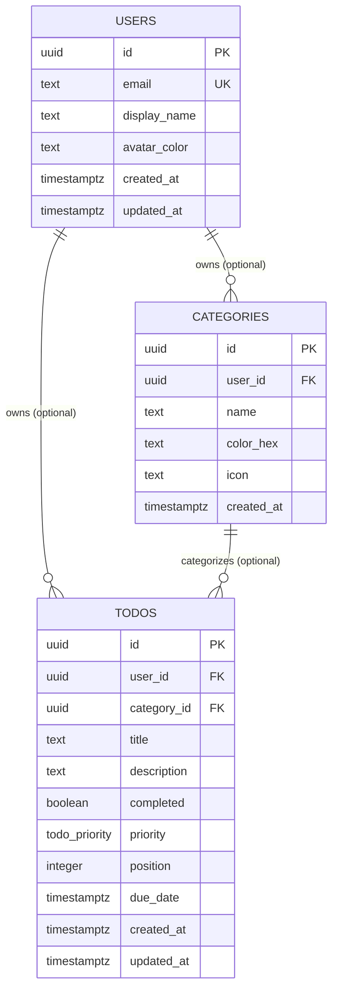

# Database — Todo App using Meta Astryx

## Overview

**Engine:** PostgreSQL 15+ (targets any PG 13+; assumes `pgcrypto` for UUID generation, compatible with managed providers such as Neon, Supabase, or RDS).

**Extensions:**
- `pgcrypto` — provides `gen_random_uuid()` for primary key generation. Enabled once via migration; no other extensions required.

**Connection strategy:**
- Single pooled connection managed by `src/lib/db/client.ts` using `node-postgres` (`pg.Pool`) wrapped by Drizzle ORM's `drizzle-orm/node-postgres` adapter.
- Pool is instantiated once per process (module-level singleton) and reused across server function invocations; not recreated per request.
- Connection string sourced exclusively from the validated `DATABASE_URL` env var (via `src/lib/config/env.ts`) — no module reads `process.env` directly.
- `todoRepository` is the only module that queries the database; all other modules reach the DB through it.

**Migration approach:**
- Drizzle Kit (`drizzle-kit generate` / `drizzle-kit migrate`) drives schema migrations from `src/lib/db/schema.ts`.
- Generated SQL migration files live in `src/lib/db/migrations/`.
- The DDL below is the authoritative source of truth for the initial migration; subsequent schema changes are additive migrations generated from Drizzle schema diffs.
- Local dev: `drizzle-kit migrate` runs against the Docker Compose Postgres instance on setup. Production: migrations run as a pre-deploy step against the target database.

## Data Models

### `users`

Lightweight identity table. Auth is not yet implemented (per architecture, authorization is "if/when added"), but `todos` and `categories` reference it via nullable FK so ownership scoping can be enabled without a breaking schema change.

| Column | Type | Constraints | Default |
|---|---|---|---|
| `id` | `uuid` | PRIMARY KEY | `gen_random_uuid()` |
| `email` | `text` | UNIQUE, NOT NULL | — |
| `display_name` | `text` | NOT NULL | — |
| `avatar_color` | `text` | NOT NULL | `'#6366f1'` |
| `created_at` | `timestamptz` | NOT NULL | `now()` |
| `updated_at` | `timestamptz` | NOT NULL | `now()` |

**Indexes:** unique index on `email` (implied by UNIQUE constraint).

### `categories`

User-defined, color-coded groupings for todos — backs the "category colors" concept in the Astryx theme layer.

| Column | Type | Constraints | Default |
|---|---|---|---|
| `id` | `uuid` | PRIMARY KEY | `gen_random_uuid()` |
| `user_id` | `uuid` | FK → `users.id` ON DELETE CASCADE, nullable | `NULL` |
| `name` | `text` | NOT NULL | — |
| `color_hex` | `text` | NOT NULL, CHECK format `^#[0-9A-Fa-f]{6}$` | `'#8b5cf6'` |
| `icon` | `text` | nullable | `NULL` |
| `created_at` | `timestamptz` | NOT NULL | `now()` |

**Indexes:** `idx_categories_user_id` on `user_id`.
**Uniqueness:** UNIQUE `(user_id, name)` — a user cannot create two categories with the same name (NULL `user_id` treated as the shared/default scope, enforced via a partial unique index).

### `todos`

Primary domain table.

| Column | Type | Constraints | Default |
|---|---|---|---|
| `id` | `uuid` | PRIMARY KEY | `gen_random_uuid()` |
| `user_id` | `uuid` | FK → `users.id` ON DELETE CASCADE, nullable | `NULL` |
| `category_id` | `uuid` | FK → `categories.id` ON DELETE SET NULL, nullable | `NULL` |
| `title` | `text` | NOT NULL, CHECK `length(title) > 0` | — |
| `description` | `text` | nullable | `NULL` |
| `completed` | `boolean` | NOT NULL | `false` |
| `priority` | `todo_priority` (enum: `low`, `medium`, `high`) | NOT NULL | `'medium'` |
| `position` | `integer` | NOT NULL | — |
| `due_date` | `timestamptz` | nullable | `NULL` |
| `created_at` | `timestamptz` | NOT NULL | `now()` |
| `updated_at` | `timestamptz` | NOT NULL | `now()` |

**Indexes:**
- `idx_todos_user_position` — composite index on `(user_id, position)` for ordered list reads (per architecture performance note).
- `idx_todos_category_id` on `category_id`.
- `idx_todos_user_completed` — composite index on `(user_id, completed)` for filtered-list queries (active/completed toggle views).

**Uniqueness:** deferrable UNIQUE constraint `(user_id, position)` — allows position swaps within a single transaction during reorder without transient collisions.

**Foreign keys:**
- `user_id` → `users.id`, `ON DELETE CASCADE` (deleting a user removes their todos).
- `category_id` → `categories.id`, `ON DELETE SET NULL` (deleting a category leaves todos uncategorized rather than deleting them).

## Entity Relationship Diagram



## DDL

```sql
-- Extensions
CREATE EXTENSION IF NOT EXISTS pgcrypto;

-- Enum types
CREATE TYPE todo_priority AS ENUM ('low', 'medium', 'high');

-- users
CREATE TABLE users (
  id            uuid PRIMARY KEY DEFAULT gen_random_uuid(),
  email         text NOT NULL UNIQUE,
  display_name  text NOT NULL,
  avatar_color  text NOT NULL DEFAULT '#6366f1',
  created_at    timestamptz NOT NULL DEFAULT now(),
  updated_at    timestamptz NOT NULL DEFAULT now()
);

-- categories
CREATE TABLE categories (
  id          uuid PRIMARY KEY DEFAULT gen_random_uuid(),
  user_id     uuid REFERENCES users(id) ON DELETE CASCADE,
  name        text NOT NULL,
  color_hex   text NOT NULL DEFAULT '#8b5cf6'
              CHECK (color_hex ~ '^#[0-9A-Fa-f]{6}$'),
  icon        text,
  created_at  timestamptz NOT NULL DEFAULT now()
);

CREATE INDEX idx_categories_user_id ON categories(user_id);

-- Uniqueness per user; NULL user_id (shared/default scope) treated via COALESCE.
CREATE UNIQUE INDEX uq_categories_user_name
  ON categories (COALESCE(user_id, '00000000-0000-0000-0000-000000000000'::uuid), name);

-- todos
CREATE TABLE todos (
  id           uuid PRIMARY KEY DEFAULT gen_random_uuid(),
  user_id      uuid REFERENCES users(id) ON DELETE CASCADE,
  category_id  uuid REFERENCES categories(id) ON DELETE SET NULL,
  title        text NOT NULL CHECK (length(title) > 0),
  description  text,
  completed    boolean NOT NULL DEFAULT false,
  priority     todo_priority NOT NULL DEFAULT 'medium',
  position     integer NOT NULL,
  due_date     timestamptz,
  created_at   timestamptz NOT NULL DEFAULT now(),
  updated_at   timestamptz NOT NULL DEFAULT now(),
  CONSTRAINT uq_todos_user_position UNIQUE (user_id, position) DEFERRABLE INITIALLY DEFERRED
);

CREATE INDEX idx_todos_user_position ON todos(user_id, position);
CREATE INDEX idx_todos_category_id ON todos(category_id);
CREATE INDEX idx_todos_user_completed ON todos(user_id, completed);

-- updated_at maintenance
CREATE OR REPLACE FUNCTION set_updated_at()
RETURNS trigger AS $$
BEGIN
  NEW.updated_at = now();
  RETURN NEW;
END;
$$ LANGUAGE plpgsql;

CREATE TRIGGER trg_users_updated_at
  BEFORE UPDATE ON users
  FOR EACH ROW EXECUTE FUNCTION set_updated_at();

CREATE TRIGGER trg_todos_updated_at
  BEFORE UPDATE ON todos
  FOR EACH ROW EXECUTE FUNCTION set_updated_at();
```

## Seed & Fixture Strategy

- **Local development seed** (`src/lib/db/seed.ts`, run via `pnpm db:seed`): inserts one demo user, a fixed set of colorful default categories (`Work` `#f97316`, `Personal` `#22c55e`, `Ideas` `#a855f7`, `Urgent` `#ef4444`) scoped to that user, and ~8 sample todos spanning all priorities and completion states so the Astryx-themed UI (priority chips, category colors, gradient accents) can be visually verified immediately after setup.
- **Default/shared categories:** rows with `user_id IS NULL` act as global defaults available to any user before they create their own; the seed script also inserts these so a fresh install has a usable palette without requiring a signed-in user.
- **Test fixtures** (Vitest): `todoRepository` and `todoOrchestrator` unit tests use factory functions (`makeTodo()`, `makeCategory()`) that build in-memory objects matching the schema types; repository integration tests run against a disposable test schema/transaction that is rolled back after each test (no shared fixture data between tests).
- **E2E fixtures** (Playwright): a dedicated `e2e` Postgres schema is truncated and reseeded with a minimal fixture set (one user, two categories, three todos) before the golden-path spec (add → toggle → reorder → delete) runs, ensuring deterministic ordering assertions.

## Query Patterns

- **List todos (ordered, filtered):**
  ```sql
  SELECT * FROM todos
  WHERE user_id = $1
    AND ($2::boolean IS NULL OR completed = $2)
    AND ($3::uuid IS NULL OR category_id = $3)
  ORDER BY position ASC;
  ```
  Served by `idx_todos_user_position` (and `idx_todos_user_completed` for the completed filter); backs `listTodos` and `TodoFilters`.

- **Fetch single todo:** `SELECT * FROM todos WHERE id = $1;` — PK lookup, used by `findById` and detail route `/todos/:id`.

- **Insert (append to end of list):**
  ```sql
  INSERT INTO todos (user_id, category_id, title, description, priority, position)
  VALUES ($1, $2, $3, $4, $5,
    (SELECT COALESCE(MAX(position), 0) + 1 FROM todos WHERE user_id = $1))
  RETURNING *;
  ```

- **Toggle completion:**
  ```sql
  UPDATE todos SET completed = NOT completed WHERE id = $1 RETURNING *;
  ```
  (`updated_at` maintained automatically by trigger.)

- **Reorder (transactional, drag-and-drop):** within a single transaction, update `position` for each affected id per the new order; the `DEFERRABLE` unique constraint on `(user_id, position)` allows intermediate collisions during the batch update, checked only at `COMMIT`.
  ```sql
  BEGIN;
  UPDATE todos SET position = $2 WHERE id = $1 AND user_id = $3;
  -- repeated for each (id, new_position) pair in the reordered list
  COMMIT;
  ```

- **Delete + compact positions:**
  ```sql
  BEGIN;
  DELETE FROM todos WHERE id = $1;
  UPDATE todos SET position = position - 1
    WHERE user_id = $2 AND position > (SELECT position FROM todos WHERE id = $1);
  COMMIT;
  ```
  (position of the deleted row captured before delete, or via `RETURNING position` on the delete statement.)

- **Category color lookup for UI theming:** `SELECT id, name, color_hex, icon FROM categories WHERE user_id = $1 OR user_id IS NULL ORDER BY name;` — used to populate category pickers and color-coded chips.